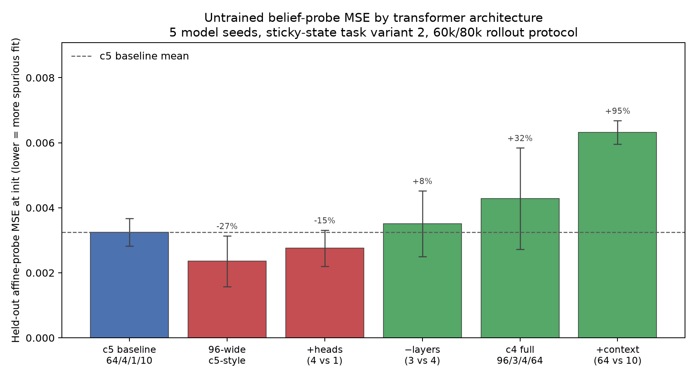

# Untrained init-probe architecture ablation — findings

## Question

When we score an affine belief probe on a **freshly initialized** transformer, how
much of the reported MSE is spurious? Probe capacity grows with representation
width: a wider residual stream gives the least-squares decoder more free parameters
to fit random activations against the belief cloud induced by the untrained
greedy policy. **Low init MSE is therefore suspicious, not desirable.** We want
init probes to look bad and stay above trivial baselines until training has
actually organized the representation.

This study isolates which architectural knobs increase or decrease that spurious
decodability at step zero.

## Protocol

| Setting | Value |
|---|---|
| Task environment | Sticky-state action-symmetry HMM, reward **variant 2** (fixed rollout setting only) |
| Model seeds | **5** (42, 43, 44, 45, 46) |
| Architectures probed | **6** (see table below) |
| Total init probes | **30** (6 × 5) |
| Checkpoint | Saved after module init, before any optimizer step |
| Probe | Held-out affine least squares on post-final-LayerNorm activations |
| Fit / eval rollouts | 60k / 80k process-weighted greedy steps, 16 parallel envs, warmup 64 |
| Representation | `post_final_layer_norm` |
| Null control | Held-out label permutation (1k resamples per probe) |

Architectures compared cycle-5 small (64-wide, 4 layers, 1 head, context 10)
against width-only and single-factor swaps, plus the cycle-4 large trunk
(96/3/4/64):

| Key | d_model | Layers | Heads | Context band | Params (approx.) |
|---|---:|---:|---:|---:|---:|
| `c5_baseline` | 64 | 4 | 1 | 10 | 201k |
| `width96_c5_style` | 96 | 4 | 1 | 10 | — |
| `ablate_heads` | 64 | 4 | 4 | 10 | — |
| `ablate_layers` | 64 | 3 | 1 | 10 | — |
| `ablate_context` | 64 | 4 | 1 | 64 | — |
| `c4_full` | 96 | 3 | 4 | 64 | 337k |

Full per-seed metrics live in `results/init_architecture_ablation.json` and
`results/<architecture>/seed_<seed>/probe_metrics.json`.

## Headline result

**Every configuration shows strong spurious decodability at init.** Typical held-out
MSE is ~0.003–0.006 while the permutation-null median is ~0.13–0.16 (global
R² ≈ 0.95–0.98). None of these init numbers should be read as “the model already
represents belief.”

From a **probe-skeptic** perspective (higher init MSE = less spurious fit):

| Architecture | Mean init MSE | SD | Δ vs c5 baseline | Verdict |
|---|---:|---:|---:|---|
| `c5_baseline` | 3.24×10⁻³ | 4.3×10⁻⁴ | — | reference |
| `width96_c5_style` | **2.36×10⁻³** | 7.8×10⁻⁴ | **−27%** | **worst** — most spurious |
| `ablate_heads` | 2.76×10⁻³ | 5.5×10⁻⁴ | −15% | more spurious |
| `ablate_layers` | 3.51×10⁻³ | 1.0×10⁻³ | +8% | slightly less spurious |
| `c4_full` | 4.28×10⁻³ | 1.6×10⁻³ | +32% | less spurious |
| `ablate_context` | **6.32×10⁻³** | 3.6×10⁻⁴ | **+95%** | **best** — least spurious |



*Figure: mean ± SD over five seeds. Red bars sit below the c5 baseline (more
spurious fit); green bars sit above it (harder for the probe to latch onto random
structure). Percent labels are change relative to the c5 baseline mean.*

## What helps and what hurts (single-factor swaps from c5 baseline)

### Hurts probe validity — lower init MSE, more spurious fit

1. **Wider residual stream (64 → 96, holding depth/heads/context fixed).**
   Mean MSE falls **27%** (3.24×10⁻³ → 2.36×10⁻³). Global R² rises from 0.974 to
   0.981. This is the cleanest demonstration that **probe feature capacity tracks
   d_model**: more coordinates for the affine map to exploit at random init.

2. **More attention heads (1 → 4, d_model fixed at 64).**
   Mean MSE falls **15%** (→ 2.76×10⁻³). Head splitting reshuffles the same
   64-dimensional representation but still modestly increases spurious
   decodability.

### Helps probe validity — higher init MSE, less spurious fit

3. **Longer context band (10 → 64 positions).**
   Mean MSE rises **95%** (→ 6.32×10⁻³), the largest single effect. Global R²
   drops to 0.948. A longer receptive field at init appears to dilute the
   linear probe’s ability to find a cheap fit on the untrained rollout distribution,
   despite increasing trunk compute.

4. **Fewer layers (4 → 3).**
   Mean MSE rises **8%** (→ 3.51×10⁻³). Shallower depth slightly reduces
   spurious fit.

### Combined cycle-4 trunk

The historical large model (`c4_full`: 96-wide, 3 layers, 4 heads, context 64)
lands **+32% above** the c5 baseline (4.28×10⁻³ vs 3.24×10⁻³). Width alone would
 have pushed MSE down; **context length and depth dominate in the opposite
 direction.** This reconciles the earlier cross-cycle observation that cycle-4
 showed *higher* init MSE than cycle-5 even though it is the “larger” model in
 parameter count.

Reproduction check: `c4_full` mean init MSE matches the archived cycle-4 variant-2
 value (4.28×10⁻³) to rounding; `c5_baseline` matches cycle-5 (3.24×10⁻³).

## Normalized metrics

Raw MSE alone can be misleading when greedy rollouts differ across architectures.
Two supplementary views from the probe README:

| Architecture | Global MSE ratio | Fine MSE ratio | Mean global R² |
|---|---:|---:|---:|
| `c5_baseline` | 0.026 | 2.58 | 0.974 |
| `width96_c5_style` | 0.019 | 2.75 | 0.981 |
| `ablate_heads` | 0.022 | 2.25 | 0.978 |
| `ablate_layers` | 0.029 | 2.92 | 0.971 |
| `c4_full` | 0.035 | 3.16 | 0.965 |
| `ablate_context` | 0.052 | 5.63 | 0.948 |

- **Global MSE ratio** (MSE / target variance): all configs are far below 1.0, so
  even untrained probes beat the global-mean belief predictor — spurious coarse
  structure is present everywhere.
- **Fine MSE ratio** (MSE / branch-centroid baseline): values ≳ 1 mean the probe
  does not beat predicting a separate centroid for each two-token branch. Only
  a few seed/config pairs dip below 1.0 at init; most “low” raw MSE still fails
  this stricter within-branch test.

## Per-seed init MSE (×10³)

| Seed | c5 baseline | 96-wide | +heads | −layers | +context | c4 full |
|---:|---:|---:|---:|---:|---:|---:|
| 42 | 3.91 | **1.41** | 3.22 | 4.84 | 5.62 | 4.61 |
| 43 | 3.29 | 3.23 | 2.71 | 4.55 | 6.32 | 4.79 |
| 44 | 3.42 | **1.76** | 2.82 | 3.13 | 6.51 | 5.87 |
| 45 | 2.92 | 2.05 | 3.29 | 2.24 | 6.61 | **1.29** |
| 46 | 2.68 | 3.32 | **1.74** | 2.81 | 6.53 | 4.85 |
| **Mean** | **3.24** | **2.36** | **2.76** | **3.51** | **6.32** | **4.28** |

Seed 45 is an outlier for `c4_full` ( unusually *high* MSE / low spurious fit).
Otherwise the ranking by mean is stable.

## Interpretation for later probe work

1. **Do not treat init MSE as a capacity bonus.** Wider models look *better* to
   the probe before training precisely because the affine decoder has more degrees
   of freedom — not because belief geometry is already present.

2. **Prefer shorter context bands when init probe numbers must be conservative,**
   if architectural choice is still open. Context 64 nearly doubles init MSE
   relative to baseline, making spurious wins harder.

3. **Cross-cycle init comparisons confound width with context and depth.** The
   cycle-4 vs cycle-5 gap is explained here as opposing effects, not a simple
   “large vs small model” story.

4. **Report init MSE alongside permutation nulls and fine ratios.** A raw init MSE
   of ~0.004 is ~30× below the label-shuffle null but still compatible with fine
   ratios above 1. Init probes are a sanity check, not evidence of representation.

## Reproduce

```bash
uv run python \
  experiments/mess3_untrained_transformer_probe_ablation_2026_08/ablation/experiment.py

uv run --with matplotlib --with numpy python \
  experiments/mess3_untrained_transformer_probe_ablation_2026_08/plot_init_ablation.py
```

Or via harness smoke:

```bash
uv run rl-harness \
  experiments.mess3_untrained_transformer_probe_ablation_2026_08.ablation.experiment \
  --smoke
```
