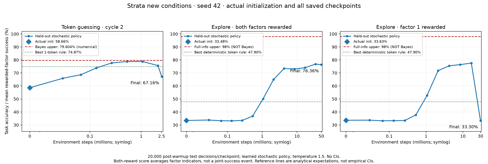
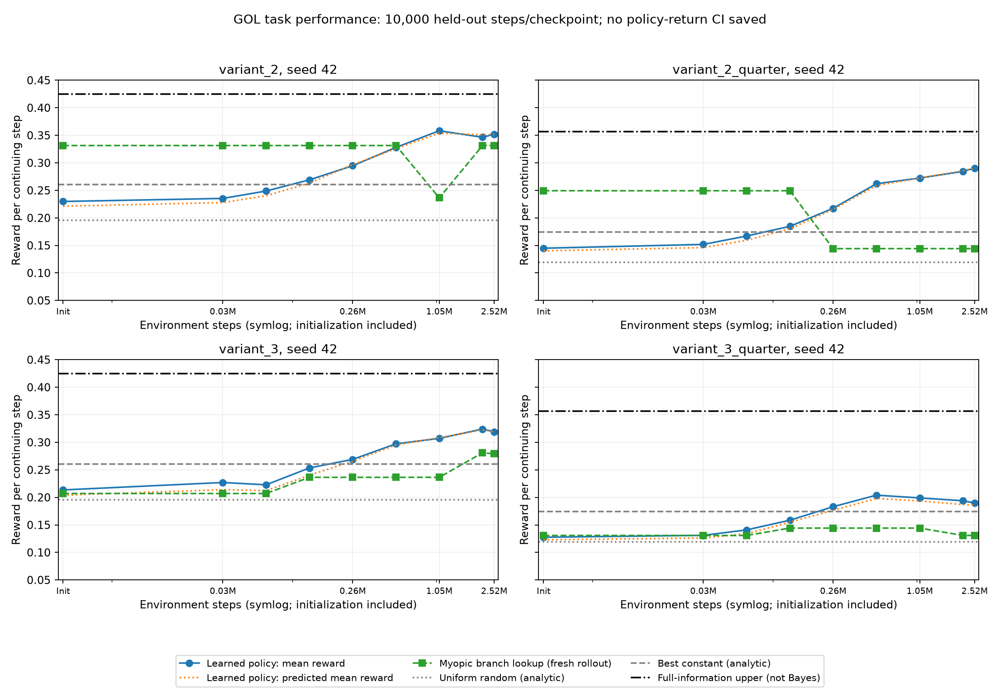

# Strata and GOL results review

## Scope and headline

**Portability note:** this is an archived results review, not a new analysis. Local links now resolve within this repository. The imported [extractor](../../../../strata_results_report.py), [checkpoint follow-up](../../../../strata_checkpoint_followup.py), and [token-probe follow-up](../../../../strata_token_probe_followup.py) locate this repository from `__file__` and the library from the installed `harness` package. Historical source hashes and absolute paths in saved JSON retain their original-generation meaning; they are not hashes of the normalized scripts. The [parameter reference](../parameter_reference_20260909.json) is preserved byte-for-byte so its digest remains verifiable; its old code locator is historical, not an execution path. The [benchmark](../../../../strata_token_guess_cycle_1/benchmark.py) is included here. No measurements, numeric tables, or plots were regenerated for portability. Exact-revision checkpoint checks still require the recorded clean harness, not an arbitrary current installation.

Reviewed the requested Strata results branch at `339e6415252bf6cc0130f37686445c7daaa1edbe`, then the GOL results branch at `ce4c868b72066bf661becc3785bc1277387f8ce6`. There are **three new completed Strata conditions and four completed GOL conditions**, all using training seed 42. One earlier GOL attempt failed and is not pooled with its replacement. The old Strata token cycle 1 is context, not a new experiment. Strata two-factor explore cycle 2 has code but no completed results on the supplied branch.

**The principal result is a dissociation in both directions:** Strata can retain substantial affine belief accessibility while its policy collapses; GOL can improve reward without accurately linearly decoding the belief contrasts its design was intended to test. Neither task performance nor probe R² should substitute for the other.

Saved checkpoint reports were cross-checked against individual probe files. Four Strata checkpoint modules were additionally downloaded, canonical-manifest SHA256-verified, and evaluated on new seeds using the exact recorded harness revision `32a15242b01450472c522f0bac250e1a2f7e2a6d`. No new policy training or activation interventions were performed. Existing worktrees and original results were not modified.

## 1. Strata experiments

### 1.1 What changed

The new point is **alpha=0.98, t0=0.30, t1=0.80**, versus the earlier **0.97, 0.38, 0.54**. The three new conditions use the same three-layer, width-64, strict-32-frame architecture, but token guessing and exploration differ in inputs, action spaces, reward timing, number of factors, discounting, optimization settings, and budgets.

- Token cycle 2 is one passive three-state HMM, two guesses, and delay-one token observations. Actions do not alter the process.
- Explore cycle 3 has two independent Strata factors with action-conditioned destination rotations, strength 1.0. Reward state is 0. The both-reward arm averages the two arrival-state indicators; it does not require simultaneous joint success.
- Both-reward training has a 50M-step threshold; single-reward training has 30M. These are not equal-budget causal comparisons.

The new token point makes history materially valuable. Independent numerical verification gives:

| Predictor/reference | Expected token accuracy |
|---|---:|
| Best constant guess, token 1 | 64.0667% |
| Best current-visible-token rule | 74.8728% |
| Stationary Bayes lower–upper bracket | 79.60296%–79.60389% |
| Valid finite-prefix bracket, at least 24 observed tokens | 79.59449%–79.60389% |
| Privileged source-state genie | 83.0000% |

The Bayes bracket combines exact suffix enumeration and the previously validated Strata renewal-residual bound. It is float64 numerical analysis, not interval-arithmetic certification or a Monte Carlo CI. The archived 32-step warmup satisfies the finite-prefix requirement. Unlike the old point, where history improved on a constant guess by only about 0.09 percentage point, the new stationary advantage is about **15.54 points**. Nevertheless, a one-token rule already supplies 10.81 of those points; the reward objective does not force exact full-belief reconstruction.

Reference data: [parameter reference](../parameter_reference_20260909.json). Extraction and reference details are in [summary.json](summary.json).

### 1.2 Performance over training

These are archived, held-out stochastic-policy scores: 20,000 retained decisions per checkpoint, eight environments, 32 warmup steps excluded per episode. All curves include the real zero-step initialization. Earlier maxima are descriptive, not replacements for final results selected using the same test set.

| Condition | Init | Highest saved evaluation | Final | Final steps |
|---|---:|---:|---:|---:|
| Token cycle 2 | 58.660% | 78.805% at 1,059,875 | **67.155%** | 2,516,889 |
| Explore cycle 3, both rewarded | 33.480% | 76.8175% at 33,908,739 | **76.360%** | 50,001,886 |
| Explore cycle 3, factor 1 rewarded | 33.630% | 77.600% at 16,935,407 | **33.295%** | 30,001,054 |

The both-reward run remains strong. The other two deteriorate substantially late in training. For exploration, 33.333% is the constant-action reference, 47.900% is a narrower deterministic single-factor current-token-only reference, and 98% is the **full-information upper bound, not a Bayes-optimal POMDP ceiling**.

### 1.3 Fresh checkpoint checks confirm the deterioration

The earlier selected checkpoints and final checkpoints were evaluated on **four fresh evaluation seeds, 10,000 retained decisions each**. Corresponding token-history hashes were identical between the passive peak/final pair. These are evaluation-seed repetitions of one trained model, not independent training runs. Ranges below are not confidence intervals.

| Condition/checkpoint | Fresh mean success | Range across evaluation seeds |
|---|---:|---:|
| Token, earlier checkpoint | **79.2525%** | 77.58%–81.22% |
| Token, final | **68.6475%** | 65.98%–71.49% |
| Single-reward explore, earlier checkpoint | **78.4075%** | 77.73%–79.10% |
| Single-reward explore, final | **33.2900%** | 33.24%–33.33% |

The decline occurs in every paired evaluation seed: a mean **10.605-point** loss for token guessing and **45.1175 points** for exploration.

For token guessing, final guesses are 92.325% token 1, versus 69.98% at the earlier checkpoint. Greedy evaluation does not rescue performance: 68.6425% final versus 79.35% earlier. This is not just excessive stochastic sampling.

For single-reward exploration, **all 40,000 evaluated final actions were joint action 6: factor 1 rotates minus, factor 2 holds**. The mean action-6 probability is 99.999041%, and mean policy entropy is 0.000126 nats. This is effectively constant on the evaluated histories, not a claim of mathematical determinism everywhere.

The collapse is also visible in training around iterations 860–865. Entropy falls from 0.10520 at iteration 853 to 0.00005566 at 861; value explained variance falls from 0.9155 at 860 to 0.00959 at 861, followed by sharply falling episode returns. These observations identify an instability, not its optimizer-level cause. Logged zero KL does not prove zero policy movement because KL loss is disabled.

Evidence and checkpoint hashes: [fresh checkpoint checks](fresh_checkpoint_checks.json). The controlled earlier checkpoint is iteration **512**, not 2048. Training episode aggregates and post-update frozen-checkpoint evaluations remain distinct estimands; the token final training aggregate of 75.8545% must not replace the lower frozen-policy scores.

### 1.4 Belief geometry and predictive controls

Last-layer archived affine scores:

| Condition / factor | Belief R² | Emission-null R² | NTP baseline R² | Log-NTP baseline R² |
|---|---:|---:|---:|---:|
| Token cycle 2 | 0.9463 | 0.9125 | Not saved | Not saved |
| Both rewarded / factor 1 | 0.5781 | 0.6072 | 0.2963 | 0.4224 |
| Both rewarded / factor 2 | 0.6195 | 0.5842 | 0.3562 | **0.6328** |
| Single rewarded / factor 1 | **0.9175** | **0.9194** | 0.4911 | 0.5848 |
| Single rewarded / factor 2, unrewarded | 0.5736 | 0.1766 | 0.5563 | **0.9525** |

The collapsed single-reward policy still has a strong rewarded-factor readout. Conversely, the successful both-reward run has more moderate readouts. The unrewarded factor is much less accessible than its log-NTP baseline. These are not evidence that full belief coding is universally necessary, sufficient, or causally used for the observed reward.

Initialization and changing occupancy matter. Token initialization already has R²=0.8494 and null R²=0.7393. Both-reward target variances shrink from about 0.178/0.180 to 0.0548/0.0515. Raw MSE changes therefore conflate representation quality with a changed visited target distribution. CEV95 dimensions at final are token 2, both 10, and single 3; these are whole-activation variance dimensions, not proof of factor-aligned or orthogonal subspaces.

I added the missing token NTP/log-NTP comparison on fresh common histories, using **fixed ridge 1e-6, 20,000 train + 20,000 test rows**, no tuned cutoff, and all three layers. This is a separate protocol from the archived random-row SVD CV, not a replacement of its scores.

| Predictor of token-cycle-2 belief | Global R² | Emission-null R² |
|---|---:|---:|
| Earlier checkpoint, last layer | **0.9791** | **0.9659** |
| Final checkpoint, last layer | 0.9471 | 0.9237 |
| Exact pending NTP | 0.5282 | 0.0078 |
| Log exact pending NTP | **0.9539** | 0.9076 |
| Current visible token | 0.2812 | 0.0006 |

The earlier checkpoint exceeds both predictive baselines. At final, log-NTP slightly exceeds the neural readout globally, while the neural readout retains a small advantage on the specified null contrast. Do not report the final high global R² alone as information beyond output statistics. The correct pending prediction is `arrival_belief @ solve(T, emission)`, not `arrival_belief @ emission`.

Evidence: [fresh token probe checks](token_probe_checks.json), [archived key metrics](key_metrics.csv), [archived controls](control_metrics.csv). Original inner CV randomly splits correlated training rows; outer train/test streams are independent. The follow-up fixed-ridge test avoids tuning on these rows, but has one independent train/test pair and no invented row-based CIs.

## 2. GOL: distinct design and results

[Detailed GOL report](../../../../gol_reward_state_action_symmetry_cycle_1/results/branch_analysis_20260909/scientific_report.md) and [belief-decoding trajectories](../../../../gol_reward_state_action_symmetry_cycle_1/results/branch_analysis_20260909/geometry_r2_from_initialization.png) are included in this repository. The supplied branch contains four completed arms, each at **2,524,368 steps / 77 iterations**, and one failed v2-half attempt at 98,352 steps. The failed attempt is not an extra seed or a continuation segment.

### 2.1 Why this is not another token-guessing task

GOL is a four-state controlled process, ordered **M1, M2, E, S**, with actions **a1, a2, aE, aS** and reward **1 on arrival in E**. Actor and shared critic see the latest token and previous action, but no reward, belief, or hidden state. It is continuing: no reset emission and no episode termination at training batch boundaries.

- **Variant 2:** M1 and M2 have an exact token-labelled controlled quotient. Both use a1 to leave efficiently; the predictive/control state can aggregate them into M. Fine M1−M2 reconstruction is not required for that quotient.
- **Variant 3:** M1 prefers a1 and M2 prefers a2. The quotient is broken. Exact all-action reward/token predictions require their distinction, although approximate action selection need not reconstruct the whole posterior as linear coordinates.
- **E versus S:** both have identical separate one-step reward and token marginals for every action, but different joint reward/token laws and future consequences. For example, pure E versus pure S changes second-step reward probability by **0.0836** under aE followed by aE at half speed, despite identical immediate marginals. The full-information long-run policy chooses aE in E but aS in S. Calling E−S task-irrelevant would be wrong.
- **Quarter speed:** only M-state escape probabilities are halved. E/S transitions are unchanged. This is not a uniform time rescaling.

The one-step reward/token marginal map has raw rank 2 in v2 and 3 in v3; the joint reward-token map has rank 3 and 4 respectively. These are analytical design facts, not evidence that the network learned any of those predictive representations.

### 2.2 Performance and geometry

| Arm | Initial → final reward/step (%) | Final fine R² | Final coarse R² | M1−M2 R² | E−S R² |
|---|---:|---:|---:|---:|---:|
| v2 half | 22.98 → **35.18** | 0.3710 | 0.5085 | 0.0659 | 0.0270 |
| v2 quarter | 14.49 → **29.04** | 0.3337 | 0.5718 | −0.0951 | 0.0496 |
| v3 half | 21.35 → **31.92** | 0.4004 | 0.5881 | 0.0331 | 0.0348 |
| v3 quarter | 12.76 → **18.98** | 0.2349 | 0.5529 | −0.1232 | 0.0103 |

These are reward-per-continuing-step probe evaluations, not episodic returns. Full-information upper references are **42.4812% half** and **35.6467% quarter**; they are **not certified Bayes/POMDP maxima**. Best-constant references are 26.0369% and 17.4383%. The learned policies improve on those constant references descriptively, but no saved policy-return CI supports a significance claim. V3-quarter ends below its earlier 20.40% saved evaluation.

The intended strong representation contrast has **not yet emerged in these affine probes**:

- Coarse decoding is already 0.46–0.51 at initialization; training improves it only modestly.
- E−S stays near zero in every arm, despite its multi-step relevance.
- M1−M2 is weak even in v3, where exact marginal controls recover it with R² essentially 1.
- Every final fine/coarse neural score is below the exact one-step-marginal decoding baseline. The results therefore do not establish full belief geometry beyond those alternatives.

This does not prove the information is absent or unused. The controller might retain decision-sufficient, nonlinear, or conditional information that an unconditional affine posterior reconstruction misses. A useful next diagnostic is a1-versus-a2 choice quality specifically where M1/M2 affects the optimal action, and E/S discrimination on histories matched for one-step marginals.

### 2.3 GOL-specific caveats

- The myopic branch-lookup controller is fitted anew to each checkpoint's occupancy; it is not an optimized long-run memoryless benchmark. Its final v2-quarter table traps itself at constant aE. The large performance gap to that collapsed lookup is not all evidence for memory.
- Each checkpoint uses 10,000 fit and 10,000 test decisions: 16 continuing trajectories, 625 retained steps per trajectory, 200 whole-trajectory MSE-bootstrap resamples. These are not training-seed replicates.
- The encoder can use 192 previous frames plus current, not a strict 64-frame total context. With warmup 64, **20.48% of sampled positions precede full context**. Rechecking with adequate context burn-in is warranted before interpreting weak contrasts too strongly.
- Shuffled histories retain the original time-indexed labels: this is broken alignment, not an alignment-preserving history perturbation with recomputed Bayes targets. Log-NTP and joint reward-token probes were not saved.
- Three completed GOL manifests mark the experiment checkout dirty. Recipes/report metadata and checked-in core source agree, but no full dirty patch was recorded. Exact code provenance for those executions cannot be certified solely by the commit SHA.

## 3. Priorities and interpretation

1. **Investigate Strata training instability first.** Preserve pre-collapse checkpoints; inspect the entropy/value-loss event and actor updates. Fresh tests confirm actual policy degradation, but do not yet identify an optimizer bug or a remedy. More training alone is not justified as a fix.
2. **Separate action quality from posterior readability.** Strata's failed controller can retain a good decoder; GOL's reward gains need not imply a faithful linear belief manifold. Neither direction is paradoxical.
3. **For GOL, tighten the benchmark and measurement design.** Use a nonmyopic finite-memory or belief-controller reference; repeat probes after at least 192 prior frames; evaluate role-specific action decisions and common-distribution histories. Do not relabel a full-state oracle as Bayes-optimal.
4. **Add independent training seeds before broad claims.** The four fresh Strata evaluation seeds strengthen a within-model diagnosis, not conclusions about training-seed reproducibility. All supplied trained arms still use seed 42.

## Output locations and validation

Strata outputs alongside this report include CSVs for every saved checkpoint/layer/factor, summary/provenance, the success PNG, the four-checkpoint verification, and the new token predictive-control comparison.

GOL outputs are under `../../../../gol_reward_state_action_symmetry_cycle_1/results/branch_analysis_20260909/`: `scientific_report.md`, `saved_results.json`, endpoint/all-probe CSVs, `task_success_from_initialization.png`, `geometry_r2_from_initialization.png`, and `geometry_mse_variance_from_initialization.png`. `design_witnesses.json` records the independent marginal/joint/two-step algebra checks.

Validation performed with the exact recorded training harness: **16 Strata recipe tests and 31 GOL recipe/probe tests passed**, without patched defaults. The extractors checked all per-checkpoint report/summary identities; GOL checked 1,152 saved metric identities. All four downloaded Strata module subtrees and associated source summaries matched canonical artifact hashes. No new training, paid compute, commits, or pushes were performed.
