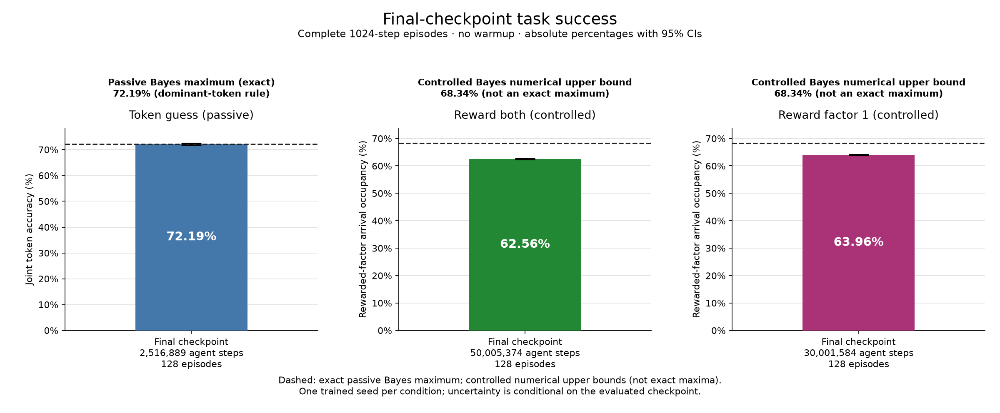

# Wing task success and specificity controls

## Task success at the final checkpoint

[Vector figure (SVG)](task_success.svg) | [Full-precision success CSV](success.csv)

Absolute task-success percentages, not probe R² and not percent of a benchmark. Each estimate uses complete 1024-step episodes, including the initial steps, with no warmup. Bars are final checkpoints, not training curves.

| Condition | Metric | Expected success % [95% CI] | Episodes | Agent steps | Bayes reference kind | Bayes reference % [95% CI] |
| --- | --- | --- | --- | --- | --- | --- |
| token_guess | joint_token_accuracy | 72.1927% [71.8207, 72.5646]% | 128 | 2516889 | exact_optimal_accuracy | 72.1933% [NA, NA]% |
| reward_both | mean_rewarded_factor_arrival_occupancy | 62.561% [62.3995, 62.7226]% | 128 | 50005374 | numerical_upper_bound | 68.3441% [NA, NA]% |
| reward_factor_1 | mean_rewarded_factor_arrival_occupancy | 63.9649% [63.795, 64.1349]% | 128 | 30001584 | numerical_upper_bound | 68.3441% [NA, NA]% |

The passive Bayes reference is the exact Bayes maximum from the statewise-dominant-token rule, not a Monte Carlo estimate. Its CI is not applicable; a separate MC cross-check is reported when available. Controlled references are numerical upper bounds, not exact or demonstrated attainable Bayes maxima; an absent or inapplicable reference CI is shown as NA.

| Condition | Reference label | Methodological summary |
| --- | --- | --- |
| token_guess | Bayes maximum (exact dominant-token rule) | Always guess (1, 1). Statewise-dominant token and stationary uniform source prior give analytic optimal accuracy; Monte Carlo is only a cross-check. |
| reward_both | Bayes planning upper bound (numerical) | Finite-horizon belief-grid planning with convex value interpolation; numerical upper bound, not an exact attainable optimum. Selected grid: 400 subdivisions. |
| reward_factor_1 | Bayes planning upper bound (numerical) | Finite-horizon belief-grid planning with convex value interpolation; numerical upper bound, not an exact attainable optimum. Selected grid: 400 subdivisions. |

[Full source evaluation](task_success_evaluation.json) contains the analytic argument, Monte Carlo cross-checks, grid refinements, convergence diagnostics, and attainable-policy evaluation where available. Full details are also retained in [success.csv](success.csv) and [report_manifest.json](report_manifest.json).

### Controlled grid-refinement audit

The selected value is the minimum computed numerical upper bound. Resolution stability is not a certified error bar or proof of equality to the continuous-belief optimum; there is no extrapolation.

| Condition | Grid subdivisions | Numerical upper bound % | Selected |
| --- | --- | --- | --- |
| reward_both | 100 | 68.367 | False |
| reward_both | 200 | 68.3483 | False |
| reward_both | 400 | 68.3441 | True |
| reward_factor_1 | 100 | 68.367 | False |
| reward_factor_1 | 200 | 68.3483 | False |
| reward_factor_1 | 400 | 68.3441 | True |

### Independent benchmark policy checks

These are Monte Carlo estimates with 95% CIs over independent full episodes. When an exact passive maximum is provided, its MC cross-check does not replace it. Controlled attainable-policy estimates are neither exact optima nor rigorous lower confidence bounds.

| Condition | Evaluation | Expected success % [95% CI] | Episodes |
| --- | --- | --- | --- |
| token_guess | Passive optimal-rule MC cross-check | 72.1685 [72.099, 72.2379] | 4096 |
| reward_both | Attainable full-belief policy (MC) | 68.3301 [68.306, 68.3543] | 4096 |
| reward_factor_1 | Attainable full-belief policy (MC) | 68.3301 [68.306, 68.3543] | 4096 |

| Condition | Evaluated checkpoint |
| --- | --- |
| token_guess | experiments/wing_token_guess_cycle_1/ppo/artifacts/20260908T000438Z-b9d3cfaa/tune/PPO_HMMEnv_e4625_00000_0_2026-09-08_00-04-42/checkpoint_000000/learner_group/learner/rl_module/default_policy |
| reward_both | experiments/wing_two_factor_explore_cycle_2/reward_both_state_0/artifacts/20260908T001136Z-9064aabc/tune/PPO_HMMEnv_ddc21_00000_0_2026-09-08_00-11-41/checkpoint_000000/learner_group/learner/rl_module/default_policy |
| reward_factor_1 | experiments/wing_two_factor_explore_cycle_2/reward_factor_1_state_0/artifacts/20260908T001436Z-51c1f6cb/tune/PPO_HMMEnv_4888e_00000_0_2026-09-08_00-14-40/checkpoint_000000/learner_group/learner/rl_module/default_policy |

## Interpretation and sampling scope

These are descriptive linear-accessibility outcomes, not evidence of causal use or a causal mechanism. CIs are episode-conditional for one trained seed per condition, not training-seed uncertainty. Probe surplus and alternative-model CIs use paired episode bootstrap with fixed fitted probes. Null repetitions are control draws, not additional trained agents. Multiple comparisons are descriptive.

The main probe view fixes the last encoder layer by index: no post-selected best layer. All layers are retained below and in CSV. Alternative candidates are selected on training histories only, never test histories or activations; the finite search is not a worst-case guarantee. Factors are never averaged, including the unrewarded factor in reward_factor_1.

Task-success full episodes are separate from the original probe collection, whose warmup and episode/sample counts remain recorded here. Controlled reports use their recorded cycle-2 parameters, not cycle-1 rotation strength.

| Condition | Parameters | Analysis seed | Fit/test samples | Fit/test episodes | Probe fit/test warmup | Bootstrap resamples |
| --- | --- | --- | --- | --- | --- | --- |
| token_guess | {"alpha":0.94,"strength":null,"x":0.4} | 42 | 20000/20000 | 30/28 | 32/32 | 200 |
| reward_both | {"alpha":0.94,"strength":1.0,"x":0.4} | 42 | 20000/20000 | 30/28 | 32/32 | 200 |
| reward_factor_1 | {"alpha":0.94,"strength":1.0,"x":0.4} | 42 | 20000/20000 | 30/28 | 32/32 | 200 |

## Last-layer belief accessibility

| Condition | Factor | Role | Layer | Probe MSE | Probe R² | Delta-contrast R² |
| --- | --- | --- | --- | --- | --- | --- |
| token_guess | factor_1 | guessed | layer_3 | 0.00779928 | 0.869641 | 0.189135 |
| token_guess | factor_2 | guessed | layer_3 | 0.00808371 | 0.865134 | 0.154478 |
| reward_both | factor_1 | rewarded | layer_3 | 0.0176531 | 0.66452 | 0.642477 |
| reward_both | factor_2 | rewarded | layer_3 | 0.00623254 | 0.839823 | 0.69667 |
| reward_factor_1 | factor_1 | rewarded | layer_3 | 0.00635358 | 0.819604 | 0.690707 |
| reward_factor_1 | factor_2 | unrewarded | layer_3 | 0.0877874 | 0.228923 | 0.315821 |

## Last-layer probe versus output and reward baselines

`ntp`/`log_ntp` use the target factor marginal; `joint_ntp`/`log_joint_ntp` use the full four-token distribution. Policy probabilities and centered log policy are separate nuisance features, not NTP. Reward features are model-derived expected immediate reward for all actions, not observed rewards fed into belief targets. MSE is unscaled belief-coordinate squared error; R² and its CIs are dimensionless, not percentages. ΔR² = probe − baseline; MSE improvement = baseline − probe (positive favors the probe).

| Condition | Factor | Layer | Baseline | Probe MSE | Probe R² | Baseline MSE | Baseline R² | ΔR² [95% CI] | MSE improvement [95% CI] |
| --- | --- | --- | --- | --- | --- | --- | --- | --- | --- |
| token_guess | factor_1 | layer_3 | train_mean | 0.00779928 | 0.869641 | 0.0600165 | -0.00312664 | 0.872768 [0.869631, 0.878274] | 0.0522172 [0.0502093, 0.0539653] |
| token_guess | factor_1 | layer_3 | ntp | 0.00779928 | 0.869641 | 0.00775606 | 0.870364 | -0.000722379 [-0.00434276, 0.00299664] | -4.32195e-05 [-0.000265254, 0.000179759] |
| token_guess | factor_1 | layer_3 | log_ntp | 0.00779928 | 0.869641 | 0.00720012 | 0.879656 | -0.0100145 [-0.0135688, -0.00630177] | -0.000599161 [-0.000817713, -0.000376966] |
| token_guess | factor_1 | layer_3 | joint_ntp | 0.00779928 | 0.869641 | 0.00775458 | 0.870388 | -0.000747078 [-0.00437286, 0.0030848] | -4.46972e-05 [-0.000262731, 0.000181953] |
| token_guess | factor_1 | layer_3 | log_joint_ntp | 0.00779928 | 0.869641 | 0.00818122 | 0.863257 | 0.00638389 [0.00298023, 0.00991413] | 0.000381944 [0.000180538, 0.000572496] |
| token_guess | factor_1 | layer_3 | policy_probabilities | 0.00779928 | 0.869641 | 0.0537233 | 0.102058 | 0.767583 [0.74724, 0.797614] | 0.045924 [0.0432191, 0.0488456] |
| token_guess | factor_1 | layer_3 | centered_log_policy | 0.00779928 | 0.869641 | 0.0280419 | 0.531303 | 0.338339 [0.329154, 0.347156] | 0.0202426 [0.0194992, 0.0208893] |
| token_guess | factor_2 | layer_3 | train_mean | 0.00808371 | 0.865134 | 0.05996 | -0.000354576 | 0.865488 [0.861222, 0.87263] | 0.0518763 [0.0501323, 0.0534889] |
| token_guess | factor_2 | layer_3 | ntp | 0.00808371 | 0.865134 | 0.00759845 | 0.87323 | -0.00809592 [-0.0134083, -0.0031794] | -0.000485259 [-0.000809733, -0.000186465] |
| token_guess | factor_2 | layer_3 | log_ntp | 0.00808371 | 0.865134 | 0.00706414 | 0.882144 | -0.0170102 [-0.0217006, -0.0124114] | -0.00101957 [-0.00131558, -0.000727895] |
| token_guess | factor_2 | layer_3 | joint_ntp | 0.00808371 | 0.865134 | 0.00761249 | 0.872995 | -0.00786157 [-0.0132534, -0.00285025] | -0.000471213 [-0.000800367, -0.000167718] |
| token_guess | factor_2 | layer_3 | log_joint_ntp | 0.00808371 | 0.865134 | 0.00809013 | 0.865027 | 0.000107195 [-0.00451535, 0.00466945] | 6.42511e-06 [-0.000274418, 0.000273996] |
| token_guess | factor_2 | layer_3 | policy_probabilities | 0.00808371 | 0.865134 | 0.0570503 | 0.0481901 | 0.816944 [0.796994, 0.844874] | 0.0489666 [0.0469345, 0.0515173] |
| token_guess | factor_2 | layer_3 | centered_log_policy | 0.00808371 | 0.865134 | 0.0441457 | 0.263487 | 0.601647 [0.589477, 0.617611] | 0.036062 [0.0348306, 0.0372027] |
| reward_both | factor_1 | layer_3 | train_mean | 0.0176531 | 0.66452 | 0.052662 | -0.000792544 | 0.665312 [0.649962, 0.676813] | 0.0350089 [0.0342385, 0.0358324] |
| reward_both | factor_1 | layer_3 | ntp | 0.0176531 | 0.66452 | 0.0203026 | 0.614168 | 0.0503522 [0.0341829, 0.0692897] | 0.00264954 [0.00182862, 0.00357767] |
| reward_both | factor_1 | layer_3 | log_ntp | 0.0176531 | 0.66452 | 0.014855 | 0.717695 | -0.0531752 [-0.0706221, -0.0363101] | -0.00279809 [-0.00376696, -0.00189649] |
| reward_both | factor_1 | layer_3 | joint_ntp | 0.0176531 | 0.66452 | 0.0195912 | 0.627687 | 0.0368328 [0.0222428, 0.0541357] | 0.00193815 [0.00117814, 0.00281032] |
| reward_both | factor_1 | layer_3 | log_joint_ntp | 0.0176531 | 0.66452 | 0.0152839 | 0.709544 | -0.0450244 [-0.0605809, -0.0312552] | -0.0023692 [-0.00321159, -0.00162087] |
| reward_both | factor_1 | layer_3 | policy_probabilities | 0.0176531 | 0.66452 | 0.0280035 | 0.46782 | 0.1967 [0.184948, 0.210558] | 0.0103504 [0.00973677, 0.0109627] |
| reward_both | factor_1 | layer_3 | centered_log_policy | 0.0176531 | 0.66452 | 0.0238147 | 0.547424 | 0.117096 [0.112628, 0.121878] | 0.00616161 [0.00591134, 0.00650244] |
| reward_both | factor_1 | layer_3 | expected_immediate_reward_all_actions | 0.0176531 | 0.66452 | 1.44919e-30 | 1 | -0.33548 [-0.351938, -0.324201] | -0.0176531 [-0.0189121, -0.01677] |
| reward_both | factor_2 | layer_3 | train_mean | 0.00623254 | 0.839823 | 0.0389385 | -0.000723093 | 0.840546 [0.827607, 0.850891] | 0.032706 [0.0320322, 0.0332968] |
| reward_both | factor_2 | layer_3 | ntp | 0.00623254 | 0.839823 | 0.00836187 | 0.785099 | 0.0547239 [0.0391024, 0.0653083] | 0.00212933 [0.00156361, 0.00255768] |
| reward_both | factor_2 | layer_3 | log_ntp | 0.00623254 | 0.839823 | 0.00824795 | 0.788027 | 0.0517961 [0.0367902, 0.0626409] | 0.00201541 [0.00146391, 0.00243466] |
| reward_both | factor_2 | layer_3 | joint_ntp | 0.00623254 | 0.839823 | 0.00785908 | 0.798021 | 0.0418022 [0.0265711, 0.052522] | 0.00162654 [0.00105113, 0.00201951] |
| reward_both | factor_2 | layer_3 | log_joint_ntp | 0.00623254 | 0.839823 | 0.00800658 | 0.79423 | 0.0455929 [0.0316142, 0.056651] | 0.00177404 [0.00123699, 0.00218578] |
| reward_both | factor_2 | layer_3 | policy_probabilities | 0.00623254 | 0.839823 | 0.0193292 | 0.503239 | 0.336584 [0.322339, 0.348025] | 0.0130966 [0.0127268, 0.0134765] |
| reward_both | factor_2 | layer_3 | centered_log_policy | 0.00623254 | 0.839823 | 0.012645 | 0.675022 | 0.164801 [0.157579, 0.171468] | 0.00641247 [0.00612012, 0.00668731] |
| reward_both | factor_2 | layer_3 | expected_immediate_reward_all_actions | 0.00623254 | 0.839823 | 2.51013e-31 | 1 | -0.160177 [-0.17296, -0.150371] | -0.00623254 [-0.00674851, -0.00577545] |
| reward_factor_1 | factor_1 | layer_3 | train_mean | 0.00635358 | 0.819604 | 0.0352486 | -0.000808441 | 0.820412 [0.798982, 0.841212] | 0.0288951 [0.028196, 0.0297208] |
| reward_factor_1 | factor_1 | layer_3 | ntp | 0.00635358 | 0.819604 | 0.0112166 | 0.681528 | 0.138076 [0.125548, 0.150774] | 0.00486305 [0.00444597, 0.00537159] |
| reward_factor_1 | factor_1 | layer_3 | log_ntp | 0.00635358 | 0.819604 | 0.0111402 | 0.683698 | 0.135906 [0.123915, 0.148685] | 0.00478663 [0.00435563, 0.00529076] |
| reward_factor_1 | factor_1 | layer_3 | joint_ntp | 0.00635358 | 0.819604 | 0.0112166 | 0.681529 | 0.138075 [0.125551, 0.15078] | 0.00486303 [0.00444631, 0.00537192] |
| reward_factor_1 | factor_1 | layer_3 | log_joint_ntp | 0.00635358 | 0.819604 | 0.0119691 | 0.660162 | 0.159442 [0.146883, 0.172495] | 0.00561557 [0.00519653, 0.00610802] |
| reward_factor_1 | factor_1 | layer_3 | policy_probabilities | 0.00635358 | 0.819604 | 0.0133105 | 0.622076 | 0.197528 [0.188507, 0.205448] | 0.00695696 [0.00669017, 0.00720373] |
| reward_factor_1 | factor_1 | layer_3 | centered_log_policy | 0.00635358 | 0.819604 | 0.0171908 | 0.511905 | 0.307699 [0.297975, 0.316199] | 0.0108372 [0.0104851, 0.011208] |
| reward_factor_1 | factor_1 | layer_3 | expected_immediate_reward_all_actions | 0.00635358 | 0.819604 | 5.51763e-31 | 1 | -0.180396 [-0.202483, -0.15962] | -0.00635358 [-0.00724458, -0.00551212] |
| reward_factor_1 | factor_2 | layer_3 | train_mean | 0.0877874 | 0.228923 | 0.113851 | -4.1313e-06 | 0.228927 [0.223068, 0.233707] | 0.0260634 [0.0251299, 0.0269192] |
| reward_factor_1 | factor_2 | layer_3 | ntp | 0.0877874 | 0.228923 | 0.0585478 | 0.485748 | -0.256825 [-0.26351, -0.251127] | -0.0292396 [-0.029866, -0.0287163] |
| reward_factor_1 | factor_2 | layer_3 | log_ntp | 0.0877874 | 0.228923 | 0.0499209 | 0.561522 | -0.332599 [-0.340648, -0.325636] | -0.0378665 [-0.0387967, -0.0371122] |
| reward_factor_1 | factor_2 | layer_3 | joint_ntp | 0.0877874 | 0.228923 | 0.0585499 | 0.485729 | -0.256806 [-0.263408, -0.251085] | -0.0292375 [-0.0298622, -0.0287165] |
| reward_factor_1 | factor_2 | layer_3 | log_joint_ntp | 0.0877874 | 0.228923 | 0.0532026 | 0.532697 | -0.303774 [-0.311295, -0.297042] | -0.0345848 [-0.0353474, -0.0339209] |
| reward_factor_1 | factor_2 | layer_3 | policy_probabilities | 0.0877874 | 0.228923 | 0.113245 | 0.00531668 | 0.223606 [0.217252, 0.228387] | 0.0254576 [0.0244642, 0.0263664] |
| reward_factor_1 | factor_2 | layer_3 | centered_log_policy | 0.0877874 | 0.228923 | 0.113184 | 0.00585668 | 0.223066 [0.216854, 0.228182] | 0.0253962 [0.0243904, 0.0262848] |
| reward_factor_1 | factor_2 | layer_3 | expected_immediate_reward_all_actions | 0.0877874 | 0.228923 | 0.113857 | -6.1318e-05 | 0.228984 [0.223168, 0.233727] | 0.0260699 [0.0251431, 0.0269276] |

## Suffix-belief baselines: 0 through 32 frames

The measured suffix lengths are 0, 1, 2, 4, 8, 16, and 32 (not every integer). Each uses the model reset prior and a training-fitted affine map to the full belief target; length 0 is a reset-prior baseline, not a policy-stationary prior.

| Condition | Factor | Role | Suffix length | Baseline MSE | Baseline R² |
| --- | --- | --- | --- | --- | --- |
| token_guess | factor_1 | guessed | 0 | 0.0600165 | -0.00312664 |
| token_guess | factor_1 | guessed | 1 | 0.0370187 | 0.381263 |
| token_guess | factor_1 | guessed | 2 | 0.0234117 | 0.608692 |
| token_guess | factor_1 | guessed | 4 | 0.0116766 | 0.804835 |
| token_guess | factor_1 | guessed | 8 | 0.00538398 | 0.910011 |
| token_guess | factor_1 | guessed | 16 | 0.00190744 | 0.968119 |
| token_guess | factor_1 | guessed | 32 | 0.000321301 | 0.99463 |
| token_guess | factor_2 | guessed | 0 | 0.05996 | -0.000354576 |
| token_guess | factor_2 | guessed | 1 | 0.0369202 | 0.384034 |
| token_guess | factor_2 | guessed | 2 | 0.0231608 | 0.613593 |
| token_guess | factor_2 | guessed | 4 | 0.0114661 | 0.808703 |
| token_guess | factor_2 | guessed | 8 | 0.00521498 | 0.912995 |
| token_guess | factor_2 | guessed | 16 | 0.00181483 | 0.969722 |
| token_guess | factor_2 | guessed | 32 | 0.00030679 | 0.994882 |
| reward_both | factor_1 | rewarded | 0 | 0.052662 | -0.000792544 |
| reward_both | factor_1 | rewarded | 1 | 0.0305495 | 0.419435 |
| reward_both | factor_1 | rewarded | 2 | 0.0230064 | 0.562785 |
| reward_both | factor_1 | rewarded | 4 | 0.0161949 | 0.69223 |
| reward_both | factor_1 | rewarded | 8 | 0.00865117 | 0.835593 |
| reward_both | factor_1 | rewarded | 16 | 0.00276329 | 0.947486 |
| reward_both | factor_1 | rewarded | 32 | 0.000184848 | 0.996487 |
| reward_both | factor_2 | rewarded | 0 | 0.0389385 | -0.000723093 |
| reward_both | factor_2 | rewarded | 1 | 0.0171514 | 0.559207 |
| reward_both | factor_2 | rewarded | 2 | 0.0125014 | 0.678712 |
| reward_both | factor_2 | rewarded | 4 | 0.00810996 | 0.791573 |
| reward_both | factor_2 | rewarded | 8 | 0.00470497 | 0.879082 |
| reward_both | factor_2 | rewarded | 16 | 0.00194941 | 0.9499 |
| reward_both | factor_2 | rewarded | 32 | 5.30381e-05 | 0.998637 |
| reward_factor_1 | factor_1 | rewarded | 0 | 0.0352486 | -0.000808441 |
| reward_factor_1 | factor_1 | rewarded | 1 | 0.0166167 | 0.528206 |
| reward_factor_1 | factor_1 | rewarded | 2 | 0.0132958 | 0.622495 |
| reward_factor_1 | factor_1 | rewarded | 4 | 0.00965385 | 0.7259 |
| reward_factor_1 | factor_1 | rewarded | 8 | 0.00609519 | 0.82694 |
| reward_factor_1 | factor_1 | rewarded | 16 | 0.00247255 | 0.929797 |
| reward_factor_1 | factor_1 | rewarded | 32 | 5.93513e-05 | 0.998315 |
| reward_factor_1 | factor_2 | unrewarded | 0 | 0.113851 | -4.1313e-06 |
| reward_factor_1 | factor_2 | unrewarded | 1 | 0.0855672 | 0.248424 |
| reward_factor_1 | factor_2 | unrewarded | 2 | 0.0638176 | 0.439461 |
| reward_factor_1 | factor_2 | unrewarded | 4 | 0.0349886 | 0.692679 |
| reward_factor_1 | factor_2 | unrewarded | 8 | 0.0108283 | 0.90489 |
| reward_factor_1 | factor_2 | unrewarded | 16 | 0.000927296 | 0.991855 |
| reward_factor_1 | factor_2 | unrewarded | 32 | 8.58248e-06 | 0.999925 |

## Last-layer matched and random controls

Mean ± sample standard deviation (ddof=1) across null repetitions, not a CI. Matched activations preserve local/output structure, so nonzero R² is not automatically a failure. These are not exchangeability-based significance tests. Every replicate, null seed, fit seed, and available matching diagnostics is retained in [null_replicates.csv](null_replicates.csv); [null_controls.csv](null_controls.csv) also stores the metric arrays.

| Condition | Factor | Layer | Control | Repeats | MSE mean ± SD | R² mean ± SD |
| --- | --- | --- | --- | --- | --- | --- |
| token_guess | factor_1 | layer_3 | dirichlet_labels | 5 | 0.0555367 ± 0.000312253 | -0.00232344 ± 0.000728703 |
| token_guess | factor_1 | layer_3 | gaussian_covariance_matched | 5 | 0.0601572 ± 5.94154e-05 | -0.00547826 ± 0.00099308 |
| token_guess | factor_1 | layer_3 | ntp_bin_matched_activations | 5 | 0.00915421 ± 3.31431e-05 | 0.846995 ± 0.00055396 |
| token_guess | factor_1 | layer_3 | shuffled_training_labels | 5 | 0.0601597 ± 0.000434191 | -0.00552012 ± 0.00725715 |
| token_guess | factor_1 | layer_3 | visible_suffix_matched_activations | 5 | 0.0372475 ± 4.45407e-05 | 0.377437 ± 0.000744462 |
| token_guess | factor_2 | layer_3 | dirichlet_labels | 5 | 0.0555367 ± 0.000312253 | -0.00232344 ± 0.000728703 |
| token_guess | factor_2 | layer_3 | gaussian_covariance_matched | 5 | 0.0600664 ± 4.55097e-05 | -0.00212994 ± 0.000759271 |
| token_guess | factor_2 | layer_3 | ntp_bin_matched_activations | 5 | 0.00923044 ± 4.92447e-05 | 0.846002 ± 0.000821584 |
| token_guess | factor_2 | layer_3 | shuffled_training_labels | 5 | 0.0604919 ± 0.000366846 | -0.00922939 ± 0.00612034 |
| token_guess | factor_2 | layer_3 | visible_suffix_matched_activations | 5 | 0.0371752 ± 3.08452e-05 | 0.379781 ± 0.000514613 |
| reward_both | factor_1 | layer_3 | dirichlet_labels | 5 | 0.0555238 ± 0.000306069 | -0.0020911 ± 0.000407363 |
| reward_both | factor_1 | layer_3 | gaussian_covariance_matched | 5 | 0.0527466 ± 2.91576e-05 | -0.00240131 ± 0.000554114 |
| reward_both | factor_1 | layer_3 | ntp_bin_matched_activations | 5 | 0.0271225 ± 0.000166812 | 0.484561 ± 0.0031701 |
| reward_both | factor_1 | layer_3 | shuffled_training_labels | 5 | 0.0529007 ± 0.00044403 | -0.00532909 ± 0.00843838 |
| reward_both | factor_1 | layer_3 | visible_suffix_matched_activations | 5 | 0.0259547 ± 9.87323e-05 | 0.506755 ± 0.00187632 |
| reward_both | factor_2 | layer_3 | dirichlet_labels | 5 | 0.0555238 ± 0.000306069 | -0.0020911 ± 0.000407363 |
| reward_both | factor_2 | layer_3 | gaussian_covariance_matched | 5 | 0.0390098 ± 2.66795e-05 | -0.00255592 ± 0.000685666 |
| reward_both | factor_2 | layer_3 | ntp_bin_matched_activations | 5 | 0.0121985 ± 5.25675e-05 | 0.686499 ± 0.00135099 |
| reward_both | factor_2 | layer_3 | shuffled_training_labels | 5 | 0.0390125 ± 0.000273666 | -0.00262299 ± 0.00703324 |
| reward_both | factor_2 | layer_3 | visible_suffix_matched_activations | 5 | 0.0147336 ± 5.26919e-05 | 0.621345 ± 0.00135418 |
| reward_factor_1 | factor_1 | layer_3 | dirichlet_labels | 5 | 0.0555136 ± 0.000289549 | -0.00190737 ± 0.000270425 |
| reward_factor_1 | factor_1 | layer_3 | gaussian_covariance_matched | 5 | 0.0353054 ± 1.67955e-05 | -0.00241951 ± 0.000476873 |
| reward_factor_1 | factor_1 | layer_3 | ntp_bin_matched_activations | 5 | 0.0138947 ± 0.00013535 | 0.60549 ± 0.00384296 |
| reward_factor_1 | factor_1 | layer_3 | shuffled_training_labels | 5 | 0.0353859 ± 0.000312064 | -0.00470636 ± 0.00886038 |
| reward_factor_1 | factor_1 | layer_3 | visible_suffix_matched_activations | 5 | 0.0147715 ± 1.2014e-05 | 0.580596 ± 0.00034111 |
| reward_factor_1 | factor_2 | layer_3 | dirichlet_labels | 5 | 0.0555136 ± 0.000289549 | -0.00190737 ± 0.000270425 |
| reward_factor_1 | factor_2 | layer_3 | gaussian_covariance_matched | 5 | 0.114053 ± 0.000129135 | -0.00177902 ± 0.00113425 |
| reward_factor_1 | factor_2 | layer_3 | ntp_bin_matched_activations | 5 | 0.105334 ± 0.000238488 | 0.0748071 ± 0.00209475 |
| reward_factor_1 | factor_2 | layer_3 | shuffled_training_labels | 5 | 0.113885 ± 0.000580593 | -0.000307793 ± 0.00509962 |
| reward_factor_1 | factor_2 | layer_3 | visible_suffix_matched_activations | 5 | 0.0885132 ± 0.000172571 | 0.222548 ± 0.00151577 |

## Last-layer shuffled-history stress test

Original unshuffled evaluation is shown beside the frozen original probe and a probe refitted on shuffled histories. Shuffling recomputes both activations and exact beliefs. This is a distribution shift, not a null required to yield zero R².

| Condition | Factor | Role | Layer | Evaluation | MSE | R² |
| --- | --- | --- | --- | --- | --- | --- |
| token_guess | factor_1 | guessed | layer_3 | original_unshuffled | 0.00779928 | 0.869641 |
| token_guess | factor_1 | guessed | layer_3 | frozen_original_probe | 0.0082754 | 0.83497 |
| token_guess | factor_1 | guessed | layer_3 | refitted_on_shuffled_histories | 0.00568926 | 0.886543 |
| token_guess | factor_2 | guessed | layer_3 | original_unshuffled | 0.00808371 | 0.865134 |
| token_guess | factor_2 | guessed | layer_3 | frozen_original_probe | 0.00847862 | 0.828288 |
| token_guess | factor_2 | guessed | layer_3 | refitted_on_shuffled_histories | 0.0059759 | 0.878974 |
| reward_both | factor_1 | rewarded | layer_3 | original_unshuffled | 0.0176531 | 0.66452 |
| reward_both | factor_1 | rewarded | layer_3 | frozen_original_probe | 0.0903945 | -0.176874 |
| reward_both | factor_1 | rewarded | layer_3 | refitted_on_shuffled_histories | 0.0602798 | 0.215198 |
| reward_both | factor_2 | rewarded | layer_3 | original_unshuffled | 0.00623254 | 0.839823 |
| reward_both | factor_2 | rewarded | layer_3 | frozen_original_probe | 0.0771743 | -0.201929 |
| reward_both | factor_2 | rewarded | layer_3 | refitted_on_shuffled_histories | 0.0460942 | 0.282118 |
| reward_factor_1 | factor_1 | rewarded | layer_3 | original_unshuffled | 0.00635358 | 0.819604 |
| reward_factor_1 | factor_1 | rewarded | layer_3 | frozen_original_probe | 0.0751514 | -0.168155 |
| reward_factor_1 | factor_1 | rewarded | layer_3 | refitted_on_shuffled_histories | 0.039661 | 0.383509 |
| reward_factor_1 | factor_2 | unrewarded | layer_3 | original_unshuffled | 0.0877874 | 0.228923 |
| reward_factor_1 | factor_2 | unrewarded | layer_3 | frozen_original_probe | 0.0723747 | 0.209908 |
| reward_factor_1 | factor_2 | unrewarded | layer_3 | refitted_on_shuffled_histories | 0.0710416 | 0.224461 |

## Last-layer alternative-model comparisons

Every training-selected candidate is evaluated separately for each factor. ΔR² = true-target probe R² − alternative-target probe R², each using its own target variance; the paired 95% interval is an R²-difference interval, not an MSE interval. Negative values favor alternative linear accessibility. KL is the mean over samples and factors in nats; for two independent factors the joint-token KL is twice this value. Test KL is diagnostic only, not a selection input.

| Condition | Factor | Role | Layer | Candidate | True R² | Alternative R² | ΔR² [95% CI] | Parameters | Selection KL | Test KL |
| --- | --- | --- | --- | --- | --- | --- | --- | --- | --- | --- |
| token_guess | factor_1 | guessed | layer_3 | alternative_2 | 0.869641 | 0.88894 | -0.019299 [-0.0235004, -0.0154438] | {"alpha":0.8799999999999999,"strength":null,"x":0.4} | 0.00877892 | 0.00905213 |
| token_guess | factor_1 | guessed | layer_3 | alternative_10 | 0.869641 | 0.872693 | -0.00305168 [-0.00711409, 0.000836257] | {"alpha":0.8799999999999999,"strength":null,"x":0.52} | 0.0103783 | 0.0105608 |
| token_guess | factor_1 | guessed | layer_3 | alternative_11 | 0.869641 | 0.877336 | -0.00769462 [-0.0095426, -0.00601571] | {"alpha":0.96,"strength":null,"x":0.28} | 0.00782908 | 0.00734447 |
| token_guess | factor_2 | guessed | layer_3 | alternative_2 | 0.865134 | 0.88449 | -0.0193562 [-0.0239263, -0.0157136] | {"alpha":0.8799999999999999,"strength":null,"x":0.4} | 0.00877892 | 0.00905213 |
| token_guess | factor_2 | guessed | layer_3 | alternative_10 | 0.865134 | 0.869303 | -0.00416922 [-0.0081924, -0.000258102] | {"alpha":0.8799999999999999,"strength":null,"x":0.52} | 0.0103783 | 0.0105608 |
| token_guess | factor_2 | guessed | layer_3 | alternative_11 | 0.865134 | 0.871279 | -0.00614553 [-0.00922922, -0.0037709] | {"alpha":0.96,"strength":null,"x":0.28} | 0.00782908 | 0.00734447 |
| reward_both | factor_1 | rewarded | layer_3 | alternative_9 | 0.66452 | 0.835974 | -0.171454 [-0.185969, -0.158464] | {"alpha":0.94,"strength":0.6,"x":0.4} | 0.0140121 | 0.0132105 |
| reward_both | factor_1 | rewarded | layer_3 | alternative_10 | 0.66452 | 0.81186 | -0.14734 [-0.158235, -0.137886] | {"alpha":0.94,"strength":0.8,"x":0.4} | 0.00528765 | 0.00491548 |
| reward_both | factor_1 | rewarded | layer_3 | alternative_12 | 0.66452 | 0.834486 | -0.169966 [-0.185038, -0.156276] | {"alpha":0.94,"strength":0.5,"x":0.4} | 0.0194401 | 0.0184158 |
| reward_both | factor_2 | rewarded | layer_3 | alternative_9 | 0.839823 | 0.853781 | -0.0139575 [-0.021436, -0.00904388] | {"alpha":0.94,"strength":0.6,"x":0.4} | 0.0140121 | 0.0132105 |
| reward_both | factor_2 | rewarded | layer_3 | alternative_10 | 0.839823 | 0.854933 | -0.0151099 [-0.020643, -0.0117225] | {"alpha":0.94,"strength":0.8,"x":0.4} | 0.00528765 | 0.00491548 |
| reward_both | factor_2 | rewarded | layer_3 | alternative_12 | 0.839823 | 0.850795 | -0.0109716 [-0.0196332, -0.00511866] | {"alpha":0.94,"strength":0.5,"x":0.4} | 0.0194401 | 0.0184158 |
| reward_factor_1 | factor_1 | rewarded | layer_3 | alternative_2 | 0.819604 | 0.860603 | -0.0409994 [-0.0482765, -0.033355] | {"alpha":0.8799999999999999,"strength":1.0,"x":0.4} | 0.0113169 | 0.011251 |
| reward_factor_1 | factor_1 | rewarded | layer_3 | alternative_10 | 0.819604 | 0.853229 | -0.0336253 [-0.0421701, -0.0249769] | {"alpha":0.94,"strength":0.8,"x":0.4} | 0.0167748 | 0.0167912 |
| reward_factor_1 | factor_2 | unrewarded | layer_3 | alternative_2 | 0.228923 | 0.300968 | -0.0720451 [-0.0734743, -0.0701511] | {"alpha":0.8799999999999999,"strength":1.0,"x":0.4} | 0.0113169 | 0.011251 |
| reward_factor_1 | factor_2 | unrewarded | layer_3 | alternative_10 | 0.228923 | 0.502749 | -0.273826 [-0.27891, -0.267976] | {"alpha":0.94,"strength":0.8,"x":0.4} | 0.0167748 | 0.0167912 |

### Training-only candidate search audit

Unselected candidates were not evaluated with test belief probes. Selection score is the minimum per-factor affine residual ratio, subject to the recorded KL budget and non-equivalence checks. Their per-factor residual and permutation diagnostics are preserved in [candidate_selection.csv](candidate_selection.csv).

| Condition | Candidate | Selected | Eligible | Parameters | Selection score | Selection KL | KL budget | Test KL |
| --- | --- | --- | --- | --- | --- | --- | --- | --- |
| token_guess | alternative_1 | False | False | {"alpha":0.82,"strength":null,"x":0.4} | 0.117785 | 0.0239329 | 0.02 | NA |
| token_guess | alternative_2 | True | True | {"alpha":0.8799999999999999,"strength":null,"x":0.4} | 0.0447397 | 0.00877892 | 0.02 | 0.00905213 |
| token_guess | alternative_3 | False | True | {"alpha":0.9149999999999999,"strength":null,"x":0.4} | 0.0107679 | 0.00202846 | 0.02 | NA |
| token_guess | alternative_4 | False | True | {"alpha":0.96,"strength":null,"x":0.4} | 0.0121156 | 0.00219242 | 0.02 | NA |
| token_guess | alternative_5 | False | True | {"alpha":0.94,"strength":null,"x":0.22000000000000003} | 0.0364448 | 0.0197194 | 0.02 | NA |
| token_guess | alternative_6 | False | False | {"alpha":0.94,"strength":null,"x":0.32} | 0.00708673 | 0.00325293 | 0.02 | NA |
| token_guess | alternative_7 | False | False | {"alpha":0.94,"strength":null,"x":0.48000000000000004} | 0.00678887 | 0.00272447 | 0.02 | NA |
| token_guess | alternative_8 | False | True | {"alpha":0.94,"strength":null,"x":0.5800000000000001} | 0.033741 | 0.0128957 | 0.02 | NA |
| token_guess | alternative_9 | False | True | {"alpha":0.8799999999999999,"strength":null,"x":0.28} | 0.0249641 | 0.0185891 | 0.02 | NA |
| token_guess | alternative_10 | True | True | {"alpha":0.8799999999999999,"strength":null,"x":0.52} | 0.0858739 | 0.0103783 | 0.02 | 0.0105608 |
| token_guess | alternative_11 | True | True | {"alpha":0.96,"strength":null,"x":0.28} | 0.0502555 | 0.00782908 | 0.02 | 0.00734447 |
| token_guess | alternative_12 | False | False | {"alpha":0.96,"strength":null,"x":0.52} | 0.00894202 | 0.0108091 | 0.02 | NA |
| reward_both | alternative_1 | False | False | {"alpha":0.82,"strength":1.0,"x":0.4} | 0.150315 | 0.0333411 | 0.02 | NA |
| reward_both | alternative_2 | False | True | {"alpha":0.8799999999999999,"strength":1.0,"x":0.4} | 0.0613496 | 0.0119321 | 0.02 | NA |
| reward_both | alternative_3 | False | True | {"alpha":0.9149999999999999,"strength":1.0,"x":0.4} | 0.0149201 | 0.00273195 | 0.02 | NA |
| reward_both | alternative_4 | False | True | {"alpha":0.96,"strength":1.0,"x":0.4} | 0.0153344 | 0.00296205 | 0.02 | NA |
| reward_both | alternative_5 | False | True | {"alpha":0.94,"strength":1.0,"x":0.22000000000000003} | 0.0154193 | 0.00766795 | 0.02 | NA |
| reward_both | alternative_6 | False | False | {"alpha":0.94,"strength":1.0,"x":0.32} | 0.00282606 | 0.00131365 | 0.02 | NA |
| reward_both | alternative_7 | False | False | {"alpha":0.94,"strength":1.0,"x":0.48000000000000004} | 0.00302003 | 0.00116182 | 0.02 | NA |
| reward_both | alternative_8 | False | True | {"alpha":0.94,"strength":1.0,"x":0.5800000000000001} | 0.0170027 | 0.00571102 | 0.02 | NA |
| reward_both | alternative_9 | True | True | {"alpha":0.94,"strength":0.6,"x":0.4} | 0.251847 | 0.0140121 | 0.02 | 0.0132105 |
| reward_both | alternative_10 | True | True | {"alpha":0.94,"strength":0.8,"x":0.4} | 0.0748887 | 0.00528765 | 0.02 | 0.00491548 |
| reward_both | alternative_11 | False | False | {"alpha":0.94,"strength":0.0,"x":0.4} | 0.78403 | 0.0679045 | 0.02 | NA |
| reward_both | alternative_12 | True | True | {"alpha":0.94,"strength":0.5,"x":0.4} | 0.359161 | 0.0194401 | 0.02 | 0.0184158 |
| reward_factor_1 | alternative_1 | False | False | {"alpha":0.82,"strength":1.0,"x":0.4} | 0.119155 | 0.0308502 | 0.02 | NA |
| reward_factor_1 | alternative_2 | True | True | {"alpha":0.8799999999999999,"strength":1.0,"x":0.4} | 0.0396183 | 0.0113169 | 0.02 | 0.011251 |
| reward_factor_1 | alternative_3 | False | False | {"alpha":0.9149999999999999,"strength":1.0,"x":0.4} | 0.0082465 | 0.00262913 | 0.02 | NA |
| reward_factor_1 | alternative_4 | False | False | {"alpha":0.96,"strength":1.0,"x":0.4} | 0.00680538 | 0.00290516 | 0.02 | NA |
| reward_factor_1 | alternative_5 | False | False | {"alpha":0.94,"strength":1.0,"x":0.22000000000000003} | 0.00994414 | 0.0137087 | 0.02 | NA |
| reward_factor_1 | alternative_6 | False | False | {"alpha":0.94,"strength":1.0,"x":0.32} | 0.0015861 | 0.00238543 | 0.02 | NA |
| reward_factor_1 | alternative_7 | False | False | {"alpha":0.94,"strength":1.0,"x":0.48000000000000004} | 0.00141284 | 0.00216111 | 0.02 | NA |
| reward_factor_1 | alternative_8 | False | False | {"alpha":0.94,"strength":1.0,"x":0.5800000000000001} | 0.00759268 | 0.0108052 | 0.02 | NA |
| reward_factor_1 | alternative_9 | False | False | {"alpha":0.94,"strength":0.6,"x":0.4} | 0.241168 | 0.0308389 | 0.02 | NA |
| reward_factor_1 | alternative_10 | True | True | {"alpha":0.94,"strength":0.8,"x":0.4} | 0.0672077 | 0.0167748 | 0.02 | 0.0167912 |
| reward_factor_1 | alternative_11 | False | False | {"alpha":0.94,"strength":0.0,"x":0.4} | 0.776471 | 0.0905348 | 0.02 | NA |
| reward_factor_1 | alternative_12 | False | False | {"alpha":0.94,"strength":0.5,"x":0.4} | 0.350071 | 0.0377343 | 0.02 | NA |

## All-layer probe comparisons (no test-layer selection)

| Condition | Factor | Layer | Baseline | Probe MSE | Probe R² | Baseline MSE | Baseline R² | ΔR² [95% CI] | MSE improvement [95% CI] |
| --- | --- | --- | --- | --- | --- | --- | --- | --- | --- |
| token_guess | factor_1 | layer_1 | train_mean | 0.00816399 | 0.863545 | 0.0600165 | -0.00312664 | 0.866672 [0.862137, 0.873621] | 0.0518525 [0.0499233, 0.053658] |
| token_guess | factor_1 | layer_1 | ntp | 0.00816399 | 0.863545 | 0.00775606 | 0.870364 | -0.00681829 [-0.0118932, -0.00100095] | -0.000407934 [-0.000699959, -5.90345e-05] |
| token_guess | factor_1 | layer_1 | log_ntp | 0.00816399 | 0.863545 | 0.00720012 | 0.879656 | -0.0161104 [-0.0210413, -0.0104969] | -0.000963876 [-0.00126041, -0.000619098] |
| token_guess | factor_1 | layer_1 | joint_ntp | 0.00816399 | 0.863545 | 0.00775458 | 0.870388 | -0.00684299 [-0.0119989, -0.000974986] | -0.000409412 [-0.000706302, -5.75837e-05] |
| token_guess | factor_1 | layer_1 | log_joint_ntp | 0.00816399 | 0.863545 | 0.00818122 | 0.863257 | 0.000287986 [-0.00430162, 0.0057381] | 1.723e-05 [-0.000263191, 0.000338896] |
| token_guess | factor_1 | layer_1 | policy_probabilities | 0.00816399 | 0.863545 | 0.0537233 | 0.102058 | 0.761487 [0.740386, 0.792107] | 0.0455593 [0.042931, 0.0485374] |
| token_guess | factor_1 | layer_1 | centered_log_policy | 0.00816399 | 0.863545 | 0.0280419 | 0.531303 | 0.332243 [0.32257, 0.342483] | 0.0198779 [0.0191136, 0.0206338] |
| token_guess | factor_1 | layer_1 | suffix_0_belief | 0.00816399 | 0.863545 | 0.0600165 | -0.00312664 | 0.866672 [0.862137, 0.873621] | 0.0518525 [0.0499233, 0.053658] |
| token_guess | factor_1 | layer_1 | suffix_1_belief | 0.00816399 | 0.863545 | 0.0370187 | 0.381263 | 0.482283 [0.474479, 0.490023] | 0.0288547 [0.0275617, 0.0299578] |
| token_guess | factor_1 | layer_1 | suffix_2_belief | 0.00816399 | 0.863545 | 0.0234117 | 0.608692 | 0.254853 [0.248776, 0.260567] | 0.0152477 [0.0145367, 0.0157967] |
| token_guess | factor_1 | layer_1 | suffix_4_belief | 0.00816399 | 0.863545 | 0.0116766 | 0.804835 | 0.0587103 [0.054014, 0.0632639] | 0.0035126 [0.00326941, 0.00376148] |
| token_guess | factor_1 | layer_1 | suffix_8_belief | 0.00816399 | 0.863545 | 0.00538398 | 0.910011 | -0.0464657 [-0.0518879, -0.0408091] | -0.00278002 [-0.00307808, -0.00246892] |
| token_guess | factor_1 | layer_1 | suffix_16_belief | 0.00816399 | 0.863545 | 0.00190744 | 0.968119 | -0.104573 [-0.111879, -0.0970774] | -0.00625655 [-0.00656885, -0.00593397] |
| token_guess | factor_1 | layer_1 | suffix_32_belief | 0.00816399 | 0.863545 | 0.000321301 | 0.99463 | -0.131084 [-0.14046, -0.121191] | -0.00784269 [-0.00822773, -0.00743269] |
| token_guess | factor_1 | layer_2 | train_mean | 0.00752566 | 0.874215 | 0.0600165 | -0.00312664 | 0.877341 [0.874007, 0.883105] | 0.0524908 [0.0504895, 0.0542403] |
| token_guess | factor_1 | layer_2 | ntp | 0.00752566 | 0.874215 | 0.00775606 | 0.870364 | 0.00385087 [-2.14274e-05, 0.00830295] | 0.000230395 [-1.29364e-06, 0.000489621] |
| token_guess | factor_1 | layer_2 | log_ntp | 0.00752566 | 0.874215 | 0.00720012 | 0.879656 | -0.00544125 [-0.00940016, -0.00127141] | -0.000325547 [-0.000565008, -7.31905e-05] |
| token_guess | factor_1 | layer_2 | joint_ntp | 0.00752566 | 0.874215 | 0.00775458 | 0.870388 | 0.00382617 [-5.31377e-05, 0.00829062] | 0.000228917 [-3.22272e-06, 0.00048948] |
| token_guess | factor_1 | layer_2 | log_joint_ntp | 0.00752566 | 0.874215 | 0.00818122 | 0.863257 | 0.0109571 [0.00737784, 0.015335] | 0.000655559 [0.000447966, 0.000881973] |
| token_guess | factor_1 | layer_2 | policy_probabilities | 0.00752566 | 0.874215 | 0.0537233 | 0.102058 | 0.772156 [0.751493, 0.80205] | 0.0461976 [0.0435115, 0.0491097] |
| token_guess | factor_1 | layer_2 | centered_log_policy | 0.00752566 | 0.874215 | 0.0280419 | 0.531303 | 0.342912 [0.333965, 0.352267] | 0.0205162 [0.0197692, 0.0211989] |
| token_guess | factor_1 | layer_2 | suffix_0_belief | 0.00752566 | 0.874215 | 0.0600165 | -0.00312664 | 0.877341 [0.874007, 0.883105] | 0.0524908 [0.0504895, 0.0542403] |
| token_guess | factor_1 | layer_2 | suffix_1_belief | 0.00752566 | 0.874215 | 0.0370187 | 0.381263 | 0.492952 [0.485504, 0.499509] | 0.029493 [0.0282033, 0.0305317] |
| token_guess | factor_1 | layer_2 | suffix_2_belief | 0.00752566 | 0.874215 | 0.0234117 | 0.608692 | 0.265523 [0.259371, 0.27109] | 0.0158861 [0.0152107, 0.0164009] |
| token_guess | factor_1 | layer_2 | suffix_4_belief | 0.00752566 | 0.874215 | 0.0116766 | 0.804835 | 0.0693795 [0.0655298, 0.0736765] | 0.00415093 [0.00399446, 0.00433074] |
| token_guess | factor_1 | layer_2 | suffix_8_belief | 0.00752566 | 0.874215 | 0.00538398 | 0.910011 | -0.0357966 [-0.0395319, -0.0321119] | -0.00214169 [-0.00234873, -0.00192531] |
| token_guess | factor_1 | layer_2 | suffix_16_belief | 0.00752566 | 0.874215 | 0.00190744 | 0.968119 | -0.0939041 [-0.100379, -0.0886839] | -0.00561822 [-0.00586686, -0.0053391] |
| token_guess | factor_1 | layer_2 | suffix_32_belief | 0.00752566 | 0.874215 | 0.000321301 | 0.99463 | -0.120415 [-0.130356, -0.112961] | -0.00720436 [-0.00755167, -0.00690244] |
| token_guess | factor_1 | layer_3 | train_mean | 0.00779928 | 0.869641 | 0.0600165 | -0.00312664 | 0.872768 [0.869631, 0.878274] | 0.0522172 [0.0502093, 0.0539653] |
| token_guess | factor_1 | layer_3 | ntp | 0.00779928 | 0.869641 | 0.00775606 | 0.870364 | -0.000722379 [-0.00434276, 0.00299664] | -4.32195e-05 [-0.000265254, 0.000179759] |
| token_guess | factor_1 | layer_3 | log_ntp | 0.00779928 | 0.869641 | 0.00720012 | 0.879656 | -0.0100145 [-0.0135688, -0.00630177] | -0.000599161 [-0.000817713, -0.000376966] |
| token_guess | factor_1 | layer_3 | joint_ntp | 0.00779928 | 0.869641 | 0.00775458 | 0.870388 | -0.000747078 [-0.00437286, 0.0030848] | -4.46972e-05 [-0.000262731, 0.000181953] |
| token_guess | factor_1 | layer_3 | log_joint_ntp | 0.00779928 | 0.869641 | 0.00818122 | 0.863257 | 0.00638389 [0.00298023, 0.00991413] | 0.000381944 [0.000180538, 0.000572496] |
| token_guess | factor_1 | layer_3 | policy_probabilities | 0.00779928 | 0.869641 | 0.0537233 | 0.102058 | 0.767583 [0.74724, 0.797614] | 0.045924 [0.0432191, 0.0488456] |
| token_guess | factor_1 | layer_3 | centered_log_policy | 0.00779928 | 0.869641 | 0.0280419 | 0.531303 | 0.338339 [0.329154, 0.347156] | 0.0202426 [0.0194992, 0.0208893] |
| token_guess | factor_1 | layer_3 | suffix_0_belief | 0.00779928 | 0.869641 | 0.0600165 | -0.00312664 | 0.872768 [0.869631, 0.878274] | 0.0522172 [0.0502093, 0.0539653] |
| token_guess | factor_1 | layer_3 | suffix_1_belief | 0.00779928 | 0.869641 | 0.0370187 | 0.381263 | 0.488378 [0.481067, 0.495049] | 0.0292194 [0.0279046, 0.0302733] |
| token_guess | factor_1 | layer_3 | suffix_2_belief | 0.00779928 | 0.869641 | 0.0234117 | 0.608692 | 0.260949 [0.254319, 0.266746] | 0.0156124 [0.0149106, 0.0161316] |
| token_guess | factor_1 | layer_3 | suffix_4_belief | 0.00779928 | 0.869641 | 0.0116766 | 0.804835 | 0.0648062 [0.0609537, 0.0688563] | 0.00387732 [0.00370437, 0.00405007] |
| token_guess | factor_1 | layer_3 | suffix_8_belief | 0.00779928 | 0.869641 | 0.00538398 | 0.910011 | -0.0403698 [-0.0437877, -0.0371184] | -0.0024153 [-0.00260007, -0.00223036] |
| token_guess | factor_1 | layer_3 | suffix_16_belief | 0.00779928 | 0.869641 | 0.00190744 | 0.968119 | -0.0984773 [-0.1054, -0.0934571] | -0.00589184 [-0.00611941, -0.0056449] |
| token_guess | factor_1 | layer_3 | suffix_32_belief | 0.00779928 | 0.869641 | 0.000321301 | 0.99463 | -0.124988 [-0.135133, -0.118047] | -0.00747798 [-0.0078494, -0.00716037] |
| token_guess | factor_2 | layer_1 | train_mean | 0.00867777 | 0.855223 | 0.05996 | -0.000354576 | 0.855577 [0.851266, 0.862654] | 0.0512822 [0.0496209, 0.0528528] |
| token_guess | factor_2 | layer_1 | ntp | 0.00867777 | 0.855223 | 0.00759845 | 0.87323 | -0.0180071 [-0.0237291, -0.0119283] | -0.00107932 [-0.001452, -0.000703509] |
| token_guess | factor_2 | layer_1 | log_ntp | 0.00867777 | 0.855223 | 0.00706414 | 0.882144 | -0.0269213 [-0.032172, -0.0212997] | -0.00161363 [-0.00196862, -0.00125621] |
| token_guess | factor_2 | layer_1 | joint_ntp | 0.00867777 | 0.855223 | 0.00761249 | 0.872995 | -0.0177727 [-0.0235725, -0.0118747] | -0.00106527 [-0.00144241, -0.000700345] |
| token_guess | factor_2 | layer_1 | log_joint_ntp | 0.00867777 | 0.855223 | 0.00809013 | 0.865027 | -0.00980394 [-0.0150755, -0.00360925] | -0.000587636 [-0.000912474, -0.000211681] |
| token_guess | factor_2 | layer_1 | policy_probabilities | 0.00867777 | 0.855223 | 0.0570503 | 0.0481901 | 0.807033 [0.787945, 0.834233] | 0.0483725 [0.046369, 0.0509111] |
| token_guess | factor_2 | layer_1 | centered_log_policy | 0.00867777 | 0.855223 | 0.0441457 | 0.263487 | 0.591736 [0.579437, 0.60907] | 0.0354679 [0.0342663, 0.0365455] |
| token_guess | factor_2 | layer_1 | suffix_0_belief | 0.00867777 | 0.855223 | 0.05996 | -0.000354576 | 0.855577 [0.851266, 0.862654] | 0.0512822 [0.0496209, 0.0528528] |
| token_guess | factor_2 | layer_1 | suffix_1_belief | 0.00867777 | 0.855223 | 0.0369202 | 0.384034 | 0.471189 [0.464282, 0.479152] | 0.0282425 [0.0271778, 0.0290871] |
| token_guess | factor_2 | layer_1 | suffix_2_belief | 0.00867777 | 0.855223 | 0.0231608 | 0.613593 | 0.24163 [0.236128, 0.248898] | 0.014483 [0.0139733, 0.0150671] |
| token_guess | factor_2 | layer_1 | suffix_4_belief | 0.00867777 | 0.855223 | 0.0114661 | 0.808703 | 0.0465197 [0.0418344, 0.052178] | 0.00278833 [0.00251935, 0.00305854] |
| token_guess | factor_2 | layer_1 | suffix_8_belief | 0.00867777 | 0.855223 | 0.00521498 | 0.912995 | -0.0577721 [-0.0614367, -0.0538388] | -0.00346279 [-0.003721, -0.0031997] |
| token_guess | factor_2 | layer_1 | suffix_16_belief | 0.00867777 | 0.855223 | 0.00181483 | 0.969722 | -0.114499 [-0.119456, -0.109755] | -0.00686294 [-0.0070993, -0.00659146] |
| token_guess | factor_2 | layer_1 | suffix_32_belief | 0.00867777 | 0.855223 | 0.00030679 | 0.994882 | -0.139659 [-0.147524, -0.133449] | -0.00837098 [-0.00861701, -0.00809508] |
| token_guess | factor_2 | layer_2 | train_mean | 0.0080045 | 0.866455 | 0.05996 | -0.000354576 | 0.86681 [0.863178, 0.8738] | 0.0519555 [0.0502782, 0.0535465] |
| token_guess | factor_2 | layer_2 | ntp | 0.0080045 | 0.866455 | 0.00759845 | 0.87323 | -0.00677448 [-0.0116248, -0.00185899] | -0.000406054 [-0.000708066, -0.000107254] |
| token_guess | factor_2 | layer_2 | log_ntp | 0.0080045 | 0.866455 | 0.00706414 | 0.882144 | -0.0156887 [-0.0199711, -0.0117915] | -0.000940362 [-0.00122145, -0.000687006] |
| token_guess | factor_2 | layer_2 | joint_ntp | 0.0080045 | 0.866455 | 0.00761249 | 0.872995 | -0.00654012 [-0.0113789, -0.00149785] | -0.000392007 [-0.000693089, -8.71191e-05] |
| token_guess | factor_2 | layer_2 | log_joint_ntp | 0.0080045 | 0.866455 | 0.00809013 | 0.865027 | 0.00142864 [-0.00295093, 0.00578904] | 8.56308e-05 [-0.0001786, 0.000336556] |
| token_guess | factor_2 | layer_2 | policy_probabilities | 0.0080045 | 0.866455 | 0.0570503 | 0.0481901 | 0.818265 [0.798181, 0.846644] | 0.0490458 [0.0469795, 0.0516125] |
| token_guess | factor_2 | layer_2 | centered_log_policy | 0.0080045 | 0.866455 | 0.0441457 | 0.263487 | 0.602968 [0.591553, 0.618293] | 0.0361412 [0.0349942, 0.0372651] |
| token_guess | factor_2 | layer_2 | suffix_0_belief | 0.0080045 | 0.866455 | 0.05996 | -0.000354576 | 0.86681 [0.863178, 0.8738] | 0.0519555 [0.0502782, 0.0535465] |
| token_guess | factor_2 | layer_2 | suffix_1_belief | 0.0080045 | 0.866455 | 0.0369202 | 0.384034 | 0.482421 [0.476032, 0.489376] | 0.0289157 [0.0278294, 0.0298299] |
| token_guess | factor_2 | layer_2 | suffix_2_belief | 0.0080045 | 0.866455 | 0.0231608 | 0.613593 | 0.252863 [0.247476, 0.259706] | 0.0151563 [0.0145958, 0.0156644] |
| token_guess | factor_2 | layer_2 | suffix_4_belief | 0.0080045 | 0.866455 | 0.0114661 | 0.808703 | 0.0577523 [0.05396, 0.0618647] | 0.0034616 [0.0032659, 0.0036414] |
| token_guess | factor_2 | layer_2 | suffix_8_belief | 0.0080045 | 0.866455 | 0.00521498 | 0.912995 | -0.0465395 [-0.048492, -0.0443228] | -0.00278952 [-0.00294191, -0.00264503] |
| token_guess | factor_2 | layer_2 | suffix_16_belief | 0.0080045 | 0.866455 | 0.00181483 | 0.969722 | -0.103267 [-0.108479, -0.0986324] | -0.00618967 [-0.00637156, -0.0059939] |
| token_guess | factor_2 | layer_2 | suffix_32_belief | 0.0080045 | 0.866455 | 0.00030679 | 0.994882 | -0.128426 [-0.136295, -0.122242] | -0.00769771 [-0.00797168, -0.00743715] |
| token_guess | factor_2 | layer_3 | train_mean | 0.00808371 | 0.865134 | 0.05996 | -0.000354576 | 0.865488 [0.861222, 0.87263] | 0.0518763 [0.0501323, 0.0534889] |
| token_guess | factor_2 | layer_3 | ntp | 0.00808371 | 0.865134 | 0.00759845 | 0.87323 | -0.00809592 [-0.0134083, -0.0031794] | -0.000485259 [-0.000809733, -0.000186465] |
| token_guess | factor_2 | layer_3 | log_ntp | 0.00808371 | 0.865134 | 0.00706414 | 0.882144 | -0.0170102 [-0.0217006, -0.0124114] | -0.00101957 [-0.00131558, -0.000727895] |
| token_guess | factor_2 | layer_3 | joint_ntp | 0.00808371 | 0.865134 | 0.00761249 | 0.872995 | -0.00786157 [-0.0132534, -0.00285025] | -0.000471213 [-0.000800367, -0.000167718] |
| token_guess | factor_2 | layer_3 | log_joint_ntp | 0.00808371 | 0.865134 | 0.00809013 | 0.865027 | 0.000107195 [-0.00451535, 0.00466945] | 6.42511e-06 [-0.000274418, 0.000273996] |
| token_guess | factor_2 | layer_3 | policy_probabilities | 0.00808371 | 0.865134 | 0.0570503 | 0.0481901 | 0.816944 [0.796994, 0.844874] | 0.0489666 [0.0469345, 0.0515173] |
| token_guess | factor_2 | layer_3 | centered_log_policy | 0.00808371 | 0.865134 | 0.0441457 | 0.263487 | 0.601647 [0.589477, 0.617611] | 0.036062 [0.0348306, 0.0372027] |
| token_guess | factor_2 | layer_3 | suffix_0_belief | 0.00808371 | 0.865134 | 0.05996 | -0.000354576 | 0.865488 [0.861222, 0.87263] | 0.0518763 [0.0501323, 0.0534889] |
| token_guess | factor_2 | layer_3 | suffix_1_belief | 0.00808371 | 0.865134 | 0.0369202 | 0.384034 | 0.4811 [0.474374, 0.488723] | 0.0288365 [0.0277425, 0.0297424] |
| token_guess | factor_2 | layer_3 | suffix_2_belief | 0.00808371 | 0.865134 | 0.0231608 | 0.613593 | 0.251541 [0.245905, 0.259256] | 0.0150771 [0.0145019, 0.0156241] |
| token_guess | factor_2 | layer_3 | suffix_4_belief | 0.00808371 | 0.865134 | 0.0114661 | 0.808703 | 0.0564308 [0.0522173, 0.0607905] | 0.00338239 [0.00317143, 0.00360746] |
| token_guess | factor_2 | layer_3 | suffix_8_belief | 0.00808371 | 0.865134 | 0.00521498 | 0.912995 | -0.047861 [-0.0505665, -0.0449921] | -0.00286873 [-0.00306321, -0.0027001] |
| token_guess | factor_2 | layer_3 | suffix_16_belief | 0.00808371 | 0.865134 | 0.00181483 | 0.969722 | -0.104588 [-0.110483, -0.0996737] | -0.00626888 [-0.00645777, -0.00605677] |
| token_guess | factor_2 | layer_3 | suffix_32_belief | 0.00808371 | 0.865134 | 0.00030679 | 0.994882 | -0.129748 [-0.137993, -0.12352] | -0.00777692 [-0.00804466, -0.00749768] |
| reward_both | factor_1 | layer_1 | train_mean | 0.0155925 | 0.703678 | 0.052662 | -0.000792544 | 0.704471 [0.68797, 0.716522] | 0.0370694 [0.0362164, 0.038225] |
| reward_both | factor_1 | layer_1 | ntp | 0.0155925 | 0.703678 | 0.0203026 | 0.614168 | 0.0895106 [0.0741108, 0.103895] | 0.00471007 [0.00397492, 0.00542148] |
| reward_both | factor_1 | layer_1 | log_ntp | 0.0155925 | 0.703678 | 0.014855 | 0.717695 | -0.0140167 [-0.0293147, 0.00157133] | -0.000737565 [-0.00156479, 8.2336e-05] |
| reward_both | factor_1 | layer_1 | joint_ntp | 0.0155925 | 0.703678 | 0.0195912 | 0.627687 | 0.0759912 [0.0620796, 0.0893585] | 0.00399868 [0.00330558, 0.0046527] |
| reward_both | factor_1 | layer_1 | log_joint_ntp | 0.0155925 | 0.703678 | 0.0152839 | 0.709544 | -0.00586599 [-0.019346, 0.00676151] | -0.00030867 [-0.00104143, 0.000349209] |
| reward_both | factor_1 | layer_1 | policy_probabilities | 0.0155925 | 0.703678 | 0.0280035 | 0.46782 | 0.235858 [0.222983, 0.24819] | 0.0124109 [0.011717, 0.0130417] |
| reward_both | factor_1 | layer_1 | centered_log_policy | 0.0155925 | 0.703678 | 0.0238147 | 0.547424 | 0.156254 [0.148707, 0.162967] | 0.00822214 [0.00787424, 0.0087342] |
| reward_both | factor_1 | layer_1 | expected_immediate_reward_all_actions | 0.0155925 | 0.703678 | 1.44919e-30 | 1 | -0.296322 [-0.313862, -0.284391] | -0.0155925 [-0.0167799, -0.0147172] |
| reward_both | factor_1 | layer_1 | suffix_0_belief | 0.0155925 | 0.703678 | 0.052662 | -0.000792544 | 0.704471 [0.68797, 0.716522] | 0.0370694 [0.0362164, 0.038225] |
| reward_both | factor_1 | layer_1 | suffix_1_belief | 0.0155925 | 0.703678 | 0.0305495 | 0.419435 | 0.284243 [0.272531, 0.293931] | 0.014957 [0.0143979, 0.0154178] |
| reward_both | factor_1 | layer_1 | suffix_2_belief | 0.0155925 | 0.703678 | 0.0230064 | 0.562785 | 0.140893 [0.128627, 0.151344] | 0.00741384 [0.00686965, 0.00785487] |
| reward_both | factor_1 | layer_1 | suffix_4_belief | 0.0155925 | 0.703678 | 0.0161949 | 0.69223 | 0.0114479 [-0.000813634, 0.0231253] | 0.000602391 [-4.22822e-05, 0.00120256] |
| reward_both | factor_1 | layer_1 | suffix_8_belief | 0.0155925 | 0.703678 | 0.00865117 | 0.835593 | -0.131914 [-0.147172, -0.118702] | -0.00694137 [-0.00793102, -0.00617355] |
| reward_both | factor_1 | layer_1 | suffix_16_belief | 0.0155925 | 0.703678 | 0.00276329 | 0.947486 | -0.243808 [-0.260442, -0.231548] | -0.0128292 [-0.0139089, -0.011969] |
| reward_both | factor_1 | layer_1 | suffix_32_belief | 0.0155925 | 0.703678 | 0.000184848 | 0.996487 | -0.292809 [-0.310024, -0.280905] | -0.0154077 [-0.0165885, -0.0145421] |
| reward_both | factor_1 | layer_2 | train_mean | 0.0167754 | 0.6812 | 0.052662 | -0.000792544 | 0.681992 [0.665229, 0.694924] | 0.0358866 [0.0350231, 0.0368165] |
| reward_both | factor_1 | layer_2 | ntp | 0.0167754 | 0.6812 | 0.0203026 | 0.614168 | 0.0670321 [0.0508939, 0.0839341] | 0.00352725 [0.00269407, 0.00436554] |
| reward_both | factor_1 | layer_2 | log_ntp | 0.0167754 | 0.6812 | 0.014855 | 0.717695 | -0.0364952 [-0.053037, -0.0213872] | -0.00192039 [-0.00282171, -0.00111788] |
| reward_both | factor_1 | layer_2 | joint_ntp | 0.0167754 | 0.6812 | 0.0195912 | 0.627687 | 0.0535128 [0.038817, 0.0687891] | 0.00281586 [0.00208799, 0.00357046] |
| reward_both | factor_1 | layer_2 | log_joint_ntp | 0.0167754 | 0.6812 | 0.0152839 | 0.709544 | -0.0283444 [-0.0432376, -0.0145524] | -0.00149149 [-0.00229719, -0.000751587] |
| reward_both | factor_1 | layer_2 | policy_probabilities | 0.0167754 | 0.6812 | 0.0280035 | 0.46782 | 0.21338 [0.201477, 0.227049] | 0.0112281 [0.0106108, 0.0118505] |
| reward_both | factor_1 | layer_2 | centered_log_policy | 0.0167754 | 0.6812 | 0.0238147 | 0.547424 | 0.133776 [0.127935, 0.139525] | 0.00703932 [0.00668203, 0.00740682] |
| reward_both | factor_1 | layer_2 | expected_immediate_reward_all_actions | 0.0167754 | 0.6812 | 1.44919e-30 | 1 | -0.3188 [-0.336392, -0.305958] | -0.0167754 [-0.0179745, -0.0158397] |
| reward_both | factor_1 | layer_2 | suffix_0_belief | 0.0167754 | 0.6812 | 0.052662 | -0.000792544 | 0.681992 [0.665229, 0.694924] | 0.0358866 [0.0350231, 0.0368165] |
| reward_both | factor_1 | layer_2 | suffix_1_belief | 0.0167754 | 0.6812 | 0.0305495 | 0.419435 | 0.261765 [0.249541, 0.2718] | 0.0137741 [0.0131964, 0.014153] |
| reward_both | factor_1 | layer_2 | suffix_2_belief | 0.0167754 | 0.6812 | 0.0230064 | 0.562785 | 0.118415 [0.105957, 0.130063] | 0.00623102 [0.00567005, 0.00670909] |
| reward_both | factor_1 | layer_2 | suffix_4_belief | 0.0167754 | 0.6812 | 0.0161949 | 0.69223 | -0.0110306 [-0.0238397, 0.00346051] | -0.000580431 [-0.00126727, 0.000179947] |
| reward_both | factor_1 | layer_2 | suffix_8_belief | 0.0167754 | 0.6812 | 0.00865117 | 0.835593 | -0.154393 [-0.171726, -0.138371] | -0.00812419 [-0.00913463, -0.00720155] |
| reward_both | factor_1 | layer_2 | suffix_16_belief | 0.0167754 | 0.6812 | 0.00276329 | 0.947486 | -0.266287 [-0.284131, -0.252665] | -0.0140121 [-0.0151749, -0.013069] |
| reward_both | factor_1 | layer_2 | suffix_32_belief | 0.0167754 | 0.6812 | 0.000184848 | 0.996487 | -0.315287 [-0.332754, -0.302644] | -0.0165905 [-0.017808, -0.0156409] |
| reward_both | factor_1 | layer_3 | train_mean | 0.0176531 | 0.66452 | 0.052662 | -0.000792544 | 0.665312 [0.649962, 0.676813] | 0.0350089 [0.0342385, 0.0358324] |
| reward_both | factor_1 | layer_3 | ntp | 0.0176531 | 0.66452 | 0.0203026 | 0.614168 | 0.0503522 [0.0341829, 0.0692897] | 0.00264954 [0.00182862, 0.00357767] |
| reward_both | factor_1 | layer_3 | log_ntp | 0.0176531 | 0.66452 | 0.014855 | 0.717695 | -0.0531752 [-0.0706221, -0.0363101] | -0.00279809 [-0.00376696, -0.00189649] |
| reward_both | factor_1 | layer_3 | joint_ntp | 0.0176531 | 0.66452 | 0.0195912 | 0.627687 | 0.0368328 [0.0222428, 0.0541357] | 0.00193815 [0.00117814, 0.00281032] |
| reward_both | factor_1 | layer_3 | log_joint_ntp | 0.0176531 | 0.66452 | 0.0152839 | 0.709544 | -0.0450244 [-0.0605809, -0.0312552] | -0.0023692 [-0.00321159, -0.00162087] |
| reward_both | factor_1 | layer_3 | policy_probabilities | 0.0176531 | 0.66452 | 0.0280035 | 0.46782 | 0.1967 [0.184948, 0.210558] | 0.0103504 [0.00973677, 0.0109627] |
| reward_both | factor_1 | layer_3 | centered_log_policy | 0.0176531 | 0.66452 | 0.0238147 | 0.547424 | 0.117096 [0.112628, 0.121878] | 0.00616161 [0.00591134, 0.00650244] |
| reward_both | factor_1 | layer_3 | expected_immediate_reward_all_actions | 0.0176531 | 0.66452 | 1.44919e-30 | 1 | -0.33548 [-0.351938, -0.324201] | -0.0176531 [-0.0189121, -0.01677] |
| reward_both | factor_1 | layer_3 | suffix_0_belief | 0.0176531 | 0.66452 | 0.052662 | -0.000792544 | 0.665312 [0.649962, 0.676813] | 0.0350089 [0.0342385, 0.0358324] |
| reward_both | factor_1 | layer_3 | suffix_1_belief | 0.0176531 | 0.66452 | 0.0305495 | 0.419435 | 0.245085 [0.233354, 0.254933] | 0.0128964 [0.0123664, 0.0133271] |
| reward_both | factor_1 | layer_3 | suffix_2_belief | 0.0176531 | 0.66452 | 0.0230064 | 0.562785 | 0.101735 [0.0893887, 0.113313] | 0.00535331 [0.00477438, 0.00587764] |
| reward_both | factor_1 | layer_3 | suffix_4_belief | 0.0176531 | 0.66452 | 0.0161949 | 0.69223 | -0.0277106 [-0.0403955, -0.0146861] | -0.00145814 [-0.00217805, -0.000755561] |
| reward_both | factor_1 | layer_3 | suffix_8_belief | 0.0176531 | 0.66452 | 0.00865117 | 0.835593 | -0.171073 [-0.186938, -0.155797] | -0.0090019 [-0.0100461, -0.00807337] |
| reward_both | factor_1 | layer_3 | suffix_16_belief | 0.0176531 | 0.66452 | 0.00276329 | 0.947486 | -0.282967 [-0.299634, -0.27002] | -0.0148898 [-0.0161147, -0.0139478] |
| reward_both | factor_1 | layer_3 | suffix_32_belief | 0.0176531 | 0.66452 | 0.000184848 | 0.996487 | -0.331967 [-0.348363, -0.320505] | -0.0174682 [-0.0187141, -0.0166068] |
| reward_both | factor_2 | layer_1 | train_mean | 0.00614772 | 0.842003 | 0.0389385 | -0.000723093 | 0.842726 [0.82832, 0.852872] | 0.0327908 [0.0321259, 0.0334436] |
| reward_both | factor_2 | layer_1 | ntp | 0.00614772 | 0.842003 | 0.00836187 | 0.785099 | 0.0569036 [0.0477452, 0.0652006] | 0.00221414 [0.00188581, 0.0025022] |
| reward_both | factor_2 | layer_1 | log_ntp | 0.00614772 | 0.842003 | 0.00824795 | 0.788027 | 0.0539758 [0.0452829, 0.0618752] | 0.00210022 [0.00176859, 0.00238348] |
| reward_both | factor_2 | layer_1 | joint_ntp | 0.00614772 | 0.842003 | 0.00785908 | 0.798021 | 0.0439819 [0.0353573, 0.0515349] | 0.00171135 [0.00139304, 0.00199456] |
| reward_both | factor_2 | layer_1 | log_joint_ntp | 0.00614772 | 0.842003 | 0.00800658 | 0.79423 | 0.0477726 [0.0388461, 0.0556114] | 0.00185885 [0.00152057, 0.00214703] |
| reward_both | factor_2 | layer_1 | policy_probabilities | 0.00614772 | 0.842003 | 0.0193292 | 0.503239 | 0.338764 [0.324524, 0.351345] | 0.0131814 [0.0127651, 0.0135932] |
| reward_both | factor_2 | layer_1 | centered_log_policy | 0.00614772 | 0.842003 | 0.012645 | 0.675022 | 0.166981 [0.156087, 0.178396] | 0.00649729 [0.00609877, 0.00695031] |
| reward_both | factor_2 | layer_1 | expected_immediate_reward_all_actions | 0.00614772 | 0.842003 | 2.51013e-31 | 1 | -0.157997 [-0.171756, -0.148301] | -0.00614772 [-0.00672388, -0.00569276] |
| reward_both | factor_2 | layer_1 | suffix_0_belief | 0.00614772 | 0.842003 | 0.0389385 | -0.000723093 | 0.842726 [0.82832, 0.852872] | 0.0327908 [0.0321259, 0.0334436] |
| reward_both | factor_2 | layer_1 | suffix_1_belief | 0.00614772 | 0.842003 | 0.0171514 | 0.559207 | 0.282796 [0.272241, 0.292974] | 0.0110037 [0.0106805, 0.0113598] |
| reward_both | factor_2 | layer_1 | suffix_2_belief | 0.00614772 | 0.842003 | 0.0125014 | 0.678712 | 0.163291 [0.153535, 0.171755] | 0.0063537 [0.00605468, 0.00660277] |
| reward_both | factor_2 | layer_1 | suffix_4_belief | 0.00614772 | 0.842003 | 0.00810996 | 0.791573 | 0.0504295 [0.04097, 0.0580953] | 0.00196223 [0.001621, 0.00224624] |
| reward_both | factor_2 | layer_1 | suffix_8_belief | 0.00614772 | 0.842003 | 0.00470497 | 0.879082 | -0.0370788 [-0.0475579, -0.0293022] | -0.00144275 [-0.00185801, -0.00112835] |
| reward_both | factor_2 | layer_1 | suffix_16_belief | 0.00614772 | 0.842003 | 0.00194941 | 0.9499 | -0.107897 [-0.120303, -0.0989688] | -0.00419831 [-0.00473866, -0.00379149] |
| reward_both | factor_2 | layer_1 | suffix_32_belief | 0.00614772 | 0.842003 | 5.30381e-05 | 0.998637 | -0.156634 [-0.169767, -0.146857] | -0.00609469 [-0.00667349, -0.00563849] |
| reward_both | factor_2 | layer_2 | train_mean | 0.00645705 | 0.834053 | 0.0389385 | -0.000723093 | 0.834777 [0.821451, 0.844044] | 0.0324815 [0.0317681, 0.0331001] |
| reward_both | factor_2 | layer_2 | ntp | 0.00645705 | 0.834053 | 0.00836187 | 0.785099 | 0.048954 [0.038334, 0.0571193] | 0.00190482 [0.00148774, 0.00219737] |
| reward_both | factor_2 | layer_2 | log_ntp | 0.00645705 | 0.834053 | 0.00824795 | 0.788027 | 0.0460262 [0.0351973, 0.0538962] | 0.0017909 [0.00136219, 0.0020721] |
| reward_both | factor_2 | layer_2 | joint_ntp | 0.00645705 | 0.834053 | 0.00785908 | 0.798021 | 0.0360323 [0.025204, 0.044168] | 0.00140203 [0.00098566, 0.00169861] |
| reward_both | factor_2 | layer_2 | log_joint_ntp | 0.00645705 | 0.834053 | 0.00800658 | 0.79423 | 0.039823 [0.029734, 0.0482077] | 0.00154953 [0.0011836, 0.0018808] |
| reward_both | factor_2 | layer_2 | policy_probabilities | 0.00645705 | 0.834053 | 0.0193292 | 0.503239 | 0.330815 [0.317797, 0.343573] | 0.0128721 [0.012428, 0.0132718] |
| reward_both | factor_2 | layer_2 | centered_log_policy | 0.00645705 | 0.834053 | 0.012645 | 0.675022 | 0.159031 [0.150357, 0.168236] | 0.00618796 [0.00588108, 0.00652738] |
| reward_both | factor_2 | layer_2 | expected_immediate_reward_all_actions | 0.00645705 | 0.834053 | 2.51013e-31 | 1 | -0.165947 [-0.179008, -0.1565] | -0.00645705 [-0.00699298, -0.00598754] |
| reward_both | factor_2 | layer_2 | suffix_0_belief | 0.00645705 | 0.834053 | 0.0389385 | -0.000723093 | 0.834777 [0.821451, 0.844044] | 0.0324815 [0.0317681, 0.0331001] |
| reward_both | factor_2 | layer_2 | suffix_1_belief | 0.00645705 | 0.834053 | 0.0171514 | 0.559207 | 0.274847 [0.264559, 0.285309] | 0.0106944 [0.0104114, 0.0110348] |
| reward_both | factor_2 | layer_2 | suffix_2_belief | 0.00645705 | 0.834053 | 0.0125014 | 0.678712 | 0.155341 [0.145154, 0.164573] | 0.00604438 [0.00574373, 0.00632182] |
| reward_both | factor_2 | layer_2 | suffix_4_belief | 0.00645705 | 0.834053 | 0.00810996 | 0.791573 | 0.0424799 [0.0328046, 0.0511378] | 0.00165291 [0.00129651, 0.00197878] |
| reward_both | factor_2 | layer_2 | suffix_8_belief | 0.00645705 | 0.834053 | 0.00470497 | 0.879082 | -0.0450284 [-0.0554706, -0.0360809] | -0.00175207 [-0.00216713, -0.00138486] |
| reward_both | factor_2 | layer_2 | suffix_16_belief | 0.00645705 | 0.834053 | 0.00194941 | 0.9499 | -0.115846 [-0.128308, -0.106471] | -0.00450763 [-0.00500414, -0.00410253] |
| reward_both | factor_2 | layer_2 | suffix_32_belief | 0.00645705 | 0.834053 | 5.30381e-05 | 0.998637 | -0.164583 [-0.177453, -0.154719] | -0.00640401 [-0.00693229, -0.00594504] |
| reward_both | factor_2 | layer_3 | train_mean | 0.00623254 | 0.839823 | 0.0389385 | -0.000723093 | 0.840546 [0.827607, 0.850891] | 0.032706 [0.0320322, 0.0332968] |
| reward_both | factor_2 | layer_3 | ntp | 0.00623254 | 0.839823 | 0.00836187 | 0.785099 | 0.0547239 [0.0391024, 0.0653083] | 0.00212933 [0.00156361, 0.00255768] |
| reward_both | factor_2 | layer_3 | log_ntp | 0.00623254 | 0.839823 | 0.00824795 | 0.788027 | 0.0517961 [0.0367902, 0.0626409] | 0.00201541 [0.00146391, 0.00243466] |
| reward_both | factor_2 | layer_3 | joint_ntp | 0.00623254 | 0.839823 | 0.00785908 | 0.798021 | 0.0418022 [0.0265711, 0.052522] | 0.00162654 [0.00105113, 0.00201951] |
| reward_both | factor_2 | layer_3 | log_joint_ntp | 0.00623254 | 0.839823 | 0.00800658 | 0.79423 | 0.0455929 [0.0316142, 0.056651] | 0.00177404 [0.00123699, 0.00218578] |
| reward_both | factor_2 | layer_3 | policy_probabilities | 0.00623254 | 0.839823 | 0.0193292 | 0.503239 | 0.336584 [0.322339, 0.348025] | 0.0130966 [0.0127268, 0.0134765] |
| reward_both | factor_2 | layer_3 | centered_log_policy | 0.00623254 | 0.839823 | 0.012645 | 0.675022 | 0.164801 [0.157579, 0.171468] | 0.00641247 [0.00612012, 0.00668731] |
| reward_both | factor_2 | layer_3 | expected_immediate_reward_all_actions | 0.00623254 | 0.839823 | 2.51013e-31 | 1 | -0.160177 [-0.17296, -0.150371] | -0.00623254 [-0.00674851, -0.00577545] |
| reward_both | factor_2 | layer_3 | suffix_0_belief | 0.00623254 | 0.839823 | 0.0389385 | -0.000723093 | 0.840546 [0.827607, 0.850891] | 0.032706 [0.0320322, 0.0332968] |
| reward_both | factor_2 | layer_3 | suffix_1_belief | 0.00623254 | 0.839823 | 0.0171514 | 0.559207 | 0.280617 [0.269331, 0.292852] | 0.0109189 [0.0106252, 0.0112702] |
| reward_both | factor_2 | layer_3 | suffix_2_belief | 0.00623254 | 0.839823 | 0.0125014 | 0.678712 | 0.161111 [0.14994, 0.171465] | 0.00626889 [0.00589051, 0.0065904] |
| reward_both | factor_2 | layer_3 | suffix_4_belief | 0.00623254 | 0.839823 | 0.00810996 | 0.791573 | 0.0482498 [0.0359822, 0.0585543] | 0.00187742 [0.00139011, 0.0022638] |
| reward_both | factor_2 | layer_3 | suffix_8_belief | 0.00623254 | 0.839823 | 0.00470497 | 0.879082 | -0.0392585 [-0.0516953, -0.0300044] | -0.00152756 [-0.00199878, -0.00115188] |
| reward_both | factor_2 | layer_3 | suffix_16_belief | 0.00623254 | 0.839823 | 0.00194941 | 0.9499 | -0.110077 [-0.122392, -0.100673] | -0.00428312 [-0.00476812, -0.00389755] |
| reward_both | factor_2 | layer_3 | suffix_32_belief | 0.00623254 | 0.839823 | 5.30381e-05 | 0.998637 | -0.158814 [-0.171518, -0.148886] | -0.0061795 [-0.00668422, -0.00572665] |
| reward_factor_1 | factor_1 | layer_1 | train_mean | 0.0115682 | 0.671547 | 0.0352486 | -0.000808441 | 0.672356 [0.644948, 0.696898] | 0.0236805 [0.0229592, 0.0244291] |
| reward_factor_1 | factor_1 | layer_1 | ntp | 0.0115682 | 0.671547 | 0.0112166 | 0.681528 | -0.00998101 [-0.0210847, -8.20134e-05] | -0.000351533 [-0.000749899, -2.81284e-06] |
| reward_factor_1 | factor_1 | layer_1 | log_ntp | 0.0115682 | 0.671547 | 0.0111402 | 0.683698 | -0.0121507 [-0.0229173, -0.00256646] | -0.000427948 [-0.000813103, -9.14545e-05] |
| reward_factor_1 | factor_1 | layer_1 | joint_ntp | 0.0115682 | 0.671547 | 0.0112166 | 0.681529 | -0.00998162 [-0.0210935, -7.7778e-05] | -0.000351555 [-0.00075028, -2.66701e-06] |
| reward_factor_1 | factor_1 | layer_1 | log_joint_ntp | 0.0115682 | 0.671547 | 0.0119691 | 0.660162 | 0.0113851 [0.000228203, 0.0219118] | 0.000400985 [8.15874e-06, 0.000763071] |
| reward_factor_1 | factor_1 | layer_1 | policy_probabilities | 0.0115682 | 0.671547 | 0.0133105 | 0.622076 | 0.0494709 [0.0342664, 0.0651774] | 0.00174237 [0.0012303, 0.00228431] |
| reward_factor_1 | factor_1 | layer_1 | centered_log_policy | 0.0115682 | 0.671547 | 0.0171908 | 0.511905 | 0.159643 [0.145474, 0.175882] | 0.00562264 [0.00518105, 0.00615228] |
| reward_factor_1 | factor_1 | layer_1 | expected_immediate_reward_all_actions | 0.0115682 | 0.671547 | 5.51763e-31 | 1 | -0.328453 [-0.356948, -0.30337] | -0.0115682 [-0.0128037, -0.0105386] |
| reward_factor_1 | factor_1 | layer_1 | suffix_0_belief | 0.0115682 | 0.671547 | 0.0352486 | -0.000808441 | 0.672356 [0.644948, 0.696898] | 0.0236805 [0.0229592, 0.0244291] |
| reward_factor_1 | factor_1 | layer_1 | suffix_1_belief | 0.0115682 | 0.671547 | 0.0166167 | 0.528206 | 0.143341 [0.127041, 0.159065] | 0.0050485 [0.0045826, 0.00553721] |
| reward_factor_1 | factor_1 | layer_1 | suffix_2_belief | 0.0115682 | 0.671547 | 0.0132958 | 0.622495 | 0.0490522 [0.0350377, 0.0609917] | 0.00172763 [0.00127218, 0.00213304] |
| reward_factor_1 | factor_1 | layer_1 | suffix_4_belief | 0.0115682 | 0.671547 | 0.00965385 | 0.7259 | -0.0543529 [-0.0690102, -0.0430765] | -0.00191432 [-0.00248022, -0.0015041] |
| reward_factor_1 | factor_1 | layer_1 | suffix_8_belief | 0.0115682 | 0.671547 | 0.00609519 | 0.82694 | -0.155393 [-0.172976, -0.140976] | -0.00547297 [-0.00619923, -0.00491891] |
| reward_factor_1 | factor_1 | layer_1 | suffix_16_belief | 0.0115682 | 0.671547 | 0.00247255 | 0.929797 | -0.25825 [-0.282899, -0.237808] | -0.00909561 [-0.0101392, -0.00822019] |
| reward_factor_1 | factor_1 | layer_1 | suffix_32_belief | 0.0115682 | 0.671547 | 5.93513e-05 | 0.998315 | -0.326768 [-0.355124, -0.301843] | -0.0115088 [-0.0127384, -0.010486] |
| reward_factor_1 | factor_1 | layer_2 | train_mean | 0.00877101 | 0.750966 | 0.0352486 | -0.000808441 | 0.751775 [0.723203, 0.772919] | 0.0264776 [0.0255956, 0.0273425] |
| reward_factor_1 | factor_1 | layer_2 | ntp | 0.00877101 | 0.750966 | 0.0112166 | 0.681528 | 0.069438 [0.0583822, 0.0808489] | 0.00244562 [0.00206258, 0.00288792] |
| reward_factor_1 | factor_1 | layer_2 | log_ntp | 0.00877101 | 0.750966 | 0.0111402 | 0.683698 | 0.0672684 [0.0558931, 0.0787474] | 0.0023692 [0.00198734, 0.00281717] |
| reward_factor_1 | factor_1 | layer_2 | joint_ntp | 0.00877101 | 0.750966 | 0.0112166 | 0.681529 | 0.0694374 [0.0583747, 0.080852] | 0.0024456 [0.00206265, 0.00288803] |
| reward_factor_1 | factor_1 | layer_2 | log_joint_ntp | 0.00877101 | 0.750966 | 0.0119691 | 0.660162 | 0.0908041 [0.0800657, 0.101759] | 0.00319814 [0.0028254, 0.00362831] |
| reward_factor_1 | factor_1 | layer_2 | policy_probabilities | 0.00877101 | 0.750966 | 0.0133105 | 0.622076 | 0.12889 [0.115032, 0.138964] | 0.00453952 [0.00408398, 0.00491313] |
| reward_factor_1 | factor_1 | layer_2 | centered_log_policy | 0.00877101 | 0.750966 | 0.0171908 | 0.511905 | 0.239062 [0.227665, 0.248837] | 0.00841979 [0.00799013, 0.00880892] |
| reward_factor_1 | factor_1 | layer_2 | expected_immediate_reward_all_actions | 0.00877101 | 0.750966 | 5.51763e-31 | 1 | -0.249034 [-0.279048, -0.227284] | -0.00877101 [-0.00994763, -0.00787259] |
| reward_factor_1 | factor_1 | layer_2 | suffix_0_belief | 0.00877101 | 0.750966 | 0.0352486 | -0.000808441 | 0.751775 [0.723203, 0.772919] | 0.0264776 [0.0255956, 0.0273425] |
| reward_factor_1 | factor_1 | layer_2 | suffix_1_belief | 0.00877101 | 0.750966 | 0.0166167 | 0.528206 | 0.22276 [0.209046, 0.234078] | 0.00784565 [0.00738958, 0.00822578] |
| reward_factor_1 | factor_1 | layer_2 | suffix_2_belief | 0.00877101 | 0.750966 | 0.0132958 | 0.622495 | 0.128471 [0.114522, 0.138397] | 0.00452478 [0.00410919, 0.0048297] |
| reward_factor_1 | factor_1 | layer_2 | suffix_4_belief | 0.00877101 | 0.750966 | 0.00965385 | 0.7259 | 0.0250661 [0.0109279, 0.0358137] | 0.000882834 [0.000394091, 0.00125936] |
| reward_factor_1 | factor_1 | layer_2 | suffix_8_belief | 0.00877101 | 0.750966 | 0.00609519 | 0.82694 | -0.0759742 [-0.091654, -0.0629688] | -0.00267582 [-0.00324527, -0.00216546] |
| reward_factor_1 | factor_1 | layer_2 | suffix_16_belief | 0.00877101 | 0.750966 | 0.00247255 | 0.929797 | -0.178831 [-0.205184, -0.160092] | -0.00629846 [-0.0072977, -0.00554218] |
| reward_factor_1 | factor_1 | layer_2 | suffix_32_belief | 0.00877101 | 0.750966 | 5.93513e-05 | 0.998315 | -0.247349 [-0.27723, -0.225512] | -0.00871166 [-0.00988281, -0.00781159] |
| reward_factor_1 | factor_1 | layer_3 | train_mean | 0.00635358 | 0.819604 | 0.0352486 | -0.000808441 | 0.820412 [0.798982, 0.841212] | 0.0288951 [0.028196, 0.0297208] |
| reward_factor_1 | factor_1 | layer_3 | ntp | 0.00635358 | 0.819604 | 0.0112166 | 0.681528 | 0.138076 [0.125548, 0.150774] | 0.00486305 [0.00444597, 0.00537159] |
| reward_factor_1 | factor_1 | layer_3 | log_ntp | 0.00635358 | 0.819604 | 0.0111402 | 0.683698 | 0.135906 [0.123915, 0.148685] | 0.00478663 [0.00435563, 0.00529076] |
| reward_factor_1 | factor_1 | layer_3 | joint_ntp | 0.00635358 | 0.819604 | 0.0112166 | 0.681529 | 0.138075 [0.125551, 0.15078] | 0.00486303 [0.00444631, 0.00537192] |
| reward_factor_1 | factor_1 | layer_3 | log_joint_ntp | 0.00635358 | 0.819604 | 0.0119691 | 0.660162 | 0.159442 [0.146883, 0.172495] | 0.00561557 [0.00519653, 0.00610802] |
| reward_factor_1 | factor_1 | layer_3 | policy_probabilities | 0.00635358 | 0.819604 | 0.0133105 | 0.622076 | 0.197528 [0.188507, 0.205448] | 0.00695696 [0.00669017, 0.00720373] |
| reward_factor_1 | factor_1 | layer_3 | centered_log_policy | 0.00635358 | 0.819604 | 0.0171908 | 0.511905 | 0.307699 [0.297975, 0.316199] | 0.0108372 [0.0104851, 0.011208] |
| reward_factor_1 | factor_1 | layer_3 | expected_immediate_reward_all_actions | 0.00635358 | 0.819604 | 5.51763e-31 | 1 | -0.180396 [-0.202483, -0.15962] | -0.00635358 [-0.00724458, -0.00551212] |
| reward_factor_1 | factor_1 | layer_3 | suffix_0_belief | 0.00635358 | 0.819604 | 0.0352486 | -0.000808441 | 0.820412 [0.798982, 0.841212] | 0.0288951 [0.028196, 0.0297208] |
| reward_factor_1 | factor_1 | layer_3 | suffix_1_belief | 0.00635358 | 0.819604 | 0.0166167 | 0.528206 | 0.291398 [0.278457, 0.302019] | 0.0102631 [0.00993087, 0.0105338] |
| reward_factor_1 | factor_1 | layer_3 | suffix_2_belief | 0.00635358 | 0.819604 | 0.0132958 | 0.622495 | 0.197109 [0.18564, 0.207535] | 0.00694221 [0.00656573, 0.00728705] |
| reward_factor_1 | factor_1 | layer_3 | suffix_4_belief | 0.00635358 | 0.819604 | 0.00965385 | 0.7259 | 0.0937038 [0.0816602, 0.107063] | 0.00330027 [0.0028799, 0.0037274] |
| reward_factor_1 | factor_1 | layer_3 | suffix_8_belief | 0.00635358 | 0.819604 | 0.00609519 | 0.82694 | -0.00733645 [-0.0207128, 0.00676025] | -0.000258391 [-0.000755966, 0.000232705] |
| reward_factor_1 | factor_1 | layer_3 | suffix_16_belief | 0.00635358 | 0.819604 | 0.00247255 | 0.929797 | -0.110193 [-0.128828, -0.0934833] | -0.00388102 [-0.00460533, -0.00319405] |
| reward_factor_1 | factor_1 | layer_3 | suffix_32_belief | 0.00635358 | 0.819604 | 5.93513e-05 | 0.998315 | -0.178711 [-0.200697, -0.157924] | -0.00629423 [-0.00717936, -0.00545355] |
| reward_factor_1 | factor_2 | layer_1 | train_mean | 0.0843971 | 0.258701 | 0.113851 | -4.1313e-06 | 0.258706 [0.251979, 0.264795] | 0.0294537 [0.0283489, 0.0305048] |
| reward_factor_1 | factor_2 | layer_1 | ntp | 0.0843971 | 0.258701 | 0.0585478 | 0.485748 | -0.227046 [-0.235061, -0.220358] | -0.0258493 [-0.0267441, -0.025186] |
| reward_factor_1 | factor_2 | layer_1 | log_ntp | 0.0843971 | 0.258701 | 0.0499209 | 0.561522 | -0.30282 [-0.312596, -0.29567] | -0.0344762 [-0.0355383, -0.0335769] |
| reward_factor_1 | factor_2 | layer_1 | joint_ntp | 0.0843971 | 0.258701 | 0.0585499 | 0.485729 | -0.227028 [-0.234977, -0.220352] | -0.0258472 [-0.026731, -0.0251853] |
| reward_factor_1 | factor_2 | layer_1 | log_joint_ntp | 0.0843971 | 0.258701 | 0.0532026 | 0.532697 | -0.273996 [-0.28304, -0.266357] | -0.0311945 [-0.0322421, -0.0303833] |
| reward_factor_1 | factor_2 | layer_1 | policy_probabilities | 0.0843971 | 0.258701 | 0.113245 | 0.00531668 | 0.253385 [0.246882, 0.259208] | 0.0288479 [0.027698, 0.0298487] |
| reward_factor_1 | factor_2 | layer_1 | centered_log_policy | 0.0843971 | 0.258701 | 0.113184 | 0.00585668 | 0.252845 [0.246093, 0.258991] | 0.0287864 [0.0276791, 0.0298888] |
| reward_factor_1 | factor_2 | layer_1 | expected_immediate_reward_all_actions | 0.0843971 | 0.258701 | 0.113857 | -6.1318e-05 | 0.258763 [0.252106, 0.264877] | 0.0294602 [0.028362, 0.0305212] |
| reward_factor_1 | factor_2 | layer_1 | suffix_0_belief | 0.0843971 | 0.258701 | 0.113851 | -4.1313e-06 | 0.258706 [0.251979, 0.264795] | 0.0294537 [0.0283489, 0.0305048] |
| reward_factor_1 | factor_2 | layer_1 | suffix_1_belief | 0.0843971 | 0.258701 | 0.0855672 | 0.248424 | 0.0102779 [0.00471642, 0.0143354] | 0.00117014 [0.000545838, 0.00163753] |
| reward_factor_1 | factor_2 | layer_1 | suffix_2_belief | 0.0843971 | 0.258701 | 0.0638176 | 0.439461 | -0.180759 [-0.187197, -0.176558] | -0.0205795 [-0.0214608, -0.0198061] |
| reward_factor_1 | factor_2 | layer_1 | suffix_4_belief | 0.0843971 | 0.258701 | 0.0349886 | 0.692679 | -0.433978 [-0.4413, -0.428694] | -0.0494085 [-0.0509568, -0.0480729] |
| reward_factor_1 | factor_2 | layer_1 | suffix_8_belief | 0.0843971 | 0.258701 | 0.0108283 | 0.90489 | -0.646189 [-0.65253, -0.64117] | -0.0735688 [-0.0755737, -0.0719134] |
| reward_factor_1 | factor_2 | layer_1 | suffix_16_belief | 0.0843971 | 0.258701 | 0.000927296 | 0.991855 | -0.733154 [-0.739958, -0.727199] | -0.0834698 [-0.0851123, -0.0818941] |
| reward_factor_1 | factor_2 | layer_1 | suffix_32_belief | 0.0843971 | 0.258701 | 8.58248e-06 | 0.999925 | -0.741223 [-0.74795, -0.735139] | -0.0843885 [-0.0859121, -0.082931] |
| reward_factor_1 | factor_2 | layer_2 | train_mean | 0.0862863 | 0.242107 | 0.113851 | -4.1313e-06 | 0.242112 [0.237214, 0.246301] | 0.0275645 [0.0266591, 0.028398] |
| reward_factor_1 | factor_2 | layer_2 | ntp | 0.0862863 | 0.242107 | 0.0585478 | 0.485748 | -0.24364 [-0.249496, -0.238631] | -0.0277385 [-0.0284307, -0.0271856] |
| reward_factor_1 | factor_2 | layer_2 | log_ntp | 0.0862863 | 0.242107 | 0.0499209 | 0.561522 | -0.319414 [-0.327727, -0.312151] | -0.0363654 [-0.0373243, -0.0354693] |
| reward_factor_1 | factor_2 | layer_2 | joint_ntp | 0.0862863 | 0.242107 | 0.0585499 | 0.485729 | -0.243622 [-0.249395, -0.238667] | -0.0277364 [-0.0284274, -0.0271912] |
| reward_factor_1 | factor_2 | layer_2 | log_joint_ntp | 0.0862863 | 0.242107 | 0.0532026 | 0.532697 | -0.29059 [-0.297928, -0.284115] | -0.0330837 [-0.033892, -0.0323237] |
| reward_factor_1 | factor_2 | layer_2 | policy_probabilities | 0.0862863 | 0.242107 | 0.113245 | 0.00531668 | 0.236791 [0.231829, 0.240989] | 0.0269587 [0.0259794, 0.0277615] |
| reward_factor_1 | factor_2 | layer_2 | centered_log_policy | 0.0862863 | 0.242107 | 0.113184 | 0.00585668 | 0.236251 [0.230782, 0.240966] | 0.0268972 [0.0259199, 0.0278008] |
| reward_factor_1 | factor_2 | layer_2 | expected_immediate_reward_all_actions | 0.0862863 | 0.242107 | 0.113857 | -6.1318e-05 | 0.242169 [0.237312, 0.246386] | 0.027571 [0.0266586, 0.0284063] |
| reward_factor_1 | factor_2 | layer_2 | suffix_0_belief | 0.0862863 | 0.242107 | 0.113851 | -4.1313e-06 | 0.242112 [0.237214, 0.246301] | 0.0275645 [0.0266591, 0.028398] |
| reward_factor_1 | factor_2 | layer_2 | suffix_1_belief | 0.0862863 | 0.242107 | 0.0855672 | 0.248424 | -0.00631602 [-0.00983002, -0.00273436] | -0.00071908 [-0.00112492, -0.000310472] |
| reward_factor_1 | factor_2 | layer_2 | suffix_2_belief | 0.0862863 | 0.242107 | 0.0638176 | 0.439461 | -0.197353 [-0.202462, -0.191982] | -0.0224687 [-0.0234299, -0.0215382] |
| reward_factor_1 | factor_2 | layer_2 | suffix_4_belief | 0.0862863 | 0.242107 | 0.0349886 | 0.692679 | -0.450572 [-0.45753, -0.443992] | -0.0512977 [-0.0529001, -0.0497105] |
| reward_factor_1 | factor_2 | layer_2 | suffix_8_belief | 0.0862863 | 0.242107 | 0.0108283 | 0.90489 | -0.662783 [-0.667732, -0.658065] | -0.075458 [-0.0774998, -0.0736194] |
| reward_factor_1 | factor_2 | layer_2 | suffix_16_belief | 0.0862863 | 0.242107 | 0.000927296 | 0.991855 | -0.749748 [-0.754554, -0.745699] | -0.085359 [-0.0872272, -0.0837977] |
| reward_factor_1 | factor_2 | layer_2 | suffix_32_belief | 0.0862863 | 0.242107 | 8.58248e-06 | 0.999925 | -0.757817 [-0.762702, -0.753641] | -0.0862777 [-0.0880422, -0.0847879] |
| reward_factor_1 | factor_2 | layer_3 | train_mean | 0.0877874 | 0.228923 | 0.113851 | -4.1313e-06 | 0.228927 [0.223068, 0.233707] | 0.0260634 [0.0251299, 0.0269192] |
| reward_factor_1 | factor_2 | layer_3 | ntp | 0.0877874 | 0.228923 | 0.0585478 | 0.485748 | -0.256825 [-0.26351, -0.251127] | -0.0292396 [-0.029866, -0.0287163] |
| reward_factor_1 | factor_2 | layer_3 | log_ntp | 0.0877874 | 0.228923 | 0.0499209 | 0.561522 | -0.332599 [-0.340648, -0.325636] | -0.0378665 [-0.0387967, -0.0371122] |
| reward_factor_1 | factor_2 | layer_3 | joint_ntp | 0.0877874 | 0.228923 | 0.0585499 | 0.485729 | -0.256806 [-0.263408, -0.251085] | -0.0292375 [-0.0298622, -0.0287165] |
| reward_factor_1 | factor_2 | layer_3 | log_joint_ntp | 0.0877874 | 0.228923 | 0.0532026 | 0.532697 | -0.303774 [-0.311295, -0.297042] | -0.0345848 [-0.0353474, -0.0339209] |
| reward_factor_1 | factor_2 | layer_3 | policy_probabilities | 0.0877874 | 0.228923 | 0.113245 | 0.00531668 | 0.223606 [0.217252, 0.228387] | 0.0254576 [0.0244642, 0.0263664] |
| reward_factor_1 | factor_2 | layer_3 | centered_log_policy | 0.0877874 | 0.228923 | 0.113184 | 0.00585668 | 0.223066 [0.216854, 0.228182] | 0.0253962 [0.0243904, 0.0262848] |
| reward_factor_1 | factor_2 | layer_3 | expected_immediate_reward_all_actions | 0.0877874 | 0.228923 | 0.113857 | -6.1318e-05 | 0.228984 [0.223168, 0.233727] | 0.0260699 [0.0251431, 0.0269276] |
| reward_factor_1 | factor_2 | layer_3 | suffix_0_belief | 0.0877874 | 0.228923 | 0.113851 | -4.1313e-06 | 0.228927 [0.223068, 0.233707] | 0.0260634 [0.0251299, 0.0269192] |
| reward_factor_1 | factor_2 | layer_3 | suffix_1_belief | 0.0877874 | 0.228923 | 0.0855672 | 0.248424 | -0.0195006 [-0.023165, -0.0162128] | -0.00222015 [-0.00265285, -0.00184834] |
| reward_factor_1 | factor_2 | layer_3 | suffix_2_belief | 0.0877874 | 0.228923 | 0.0638176 | 0.439461 | -0.210538 [-0.21573, -0.205712] | -0.0239698 [-0.0249402, -0.0231445] |
| reward_factor_1 | factor_2 | layer_3 | suffix_4_belief | 0.0877874 | 0.228923 | 0.0349886 | 0.692679 | -0.463756 [-0.47001, -0.457774] | -0.0527988 [-0.054379, -0.051402] |
| reward_factor_1 | factor_2 | layer_3 | suffix_8_belief | 0.0877874 | 0.228923 | 0.0108283 | 0.90489 | -0.675967 [-0.68092, -0.671982] | -0.0769591 [-0.0788249, -0.0752336] |
| reward_factor_1 | factor_2 | layer_3 | suffix_16_belief | 0.0877874 | 0.228923 | 0.000927296 | 0.991855 | -0.762932 [-0.768544, -0.758618] | -0.0868601 [-0.0885227, -0.0854385] |
| reward_factor_1 | factor_2 | layer_3 | suffix_32_belief | 0.0877874 | 0.228923 | 8.58248e-06 | 0.999925 | -0.771002 [-0.776869, -0.766246] | -0.0877788 [-0.0893851, -0.0864274] |

## Machine-readable results and provenance

[success.csv](success.csv) | [probe_comparison.csv](probe_comparison.csv) | [suffix_baselines.csv](suffix_baselines.csv) | [null_controls.csv](null_controls.csv) | [null_replicates.csv](null_replicates.csv) | [history_shuffle.csv](history_shuffle.csv) | [alternative_models.csv](alternative_models.csv) | [candidate_selection.csv](candidate_selection.csv)

[Reproducibility manifest](report_manifest.json) records input hashes, seed sources, source provenance, and output hashes. CSV retains full floating-point precision; NA/blank means unavailable, never zero.
